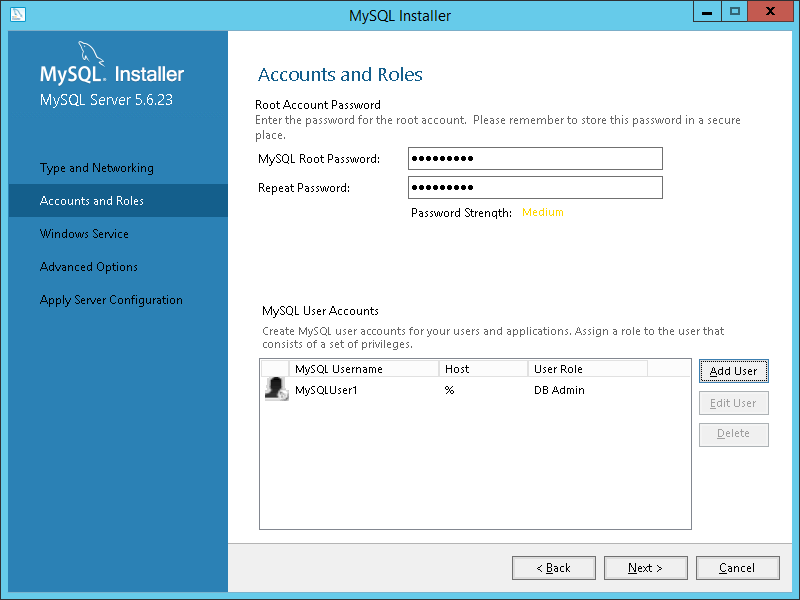
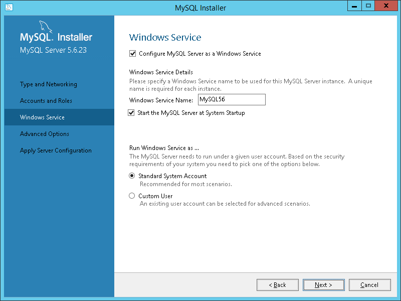
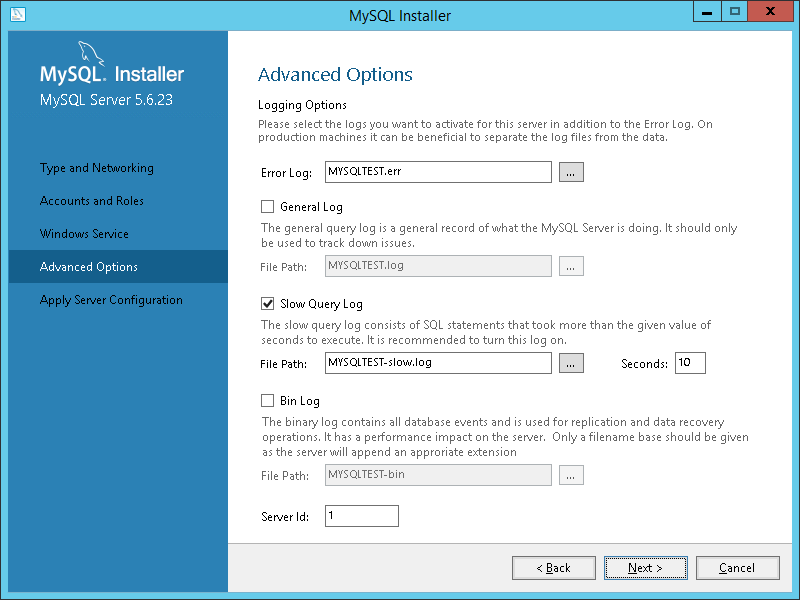
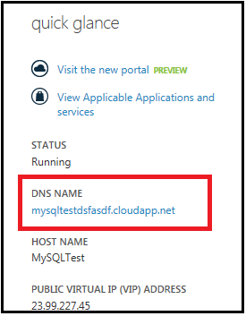

<properties 
	pageTitle="Erstellen eines virtuellen Computers unter MySQL in Azure" 
	description="Erstellen Sie einen virtuellen Azure-Computer unter Windows Server 2012 R2, und installieren und konfigurieren Sie dann eine MySQL-Datenbank auf dem virtuellen Computer." 
	services="virtual-machines" 
	documentationCenter="" 
	authors="KBDAzure" 
	manager="timlt" 
	editor="tysonn"/>

<tags 
	ms.service="virtual-machines" 
	ms.workload="infrastructure-services" 
	ms.tgt_pltfrm="vm-windows" 
	ms.devlang="na" 
	ms.topic="article" 
	ms.date="02/20/2015" 
	ms.author="kathydav"/>

# Installieren von MySQL auf einem virtuellen Computer mit Windows Server 2012 R2 in Azure

[MySQL](http://www.mysql.com) ist eine beliebte Open-Source-SQL-Datenbank. Mit dem [Azure-Verwaltungsportal](http://manage.windowsazure.com) können Sie über die Bildergalerie einen virtuellen Windows Server 2012 R2-Computer erstellen. Sie können ihn dann als MySQL-Server installieren und konfigurieren.

Dieses Lernprogramm beschreibt Folgendes:

- Verwenden des Verwaltungsportals zum Erstellen eines virtuellen Computers mit Windows Server 2012 R2

- Installieren Sie die Community-Version von MySQL 5.6.23 als MySQL-Server auf dem virtuellen Computer, und führen Sie sie aus.

## Erstellen eines virtuellen Computers unter Windows Server

[AZURE.INCLUDE [virtual-machines-create-WindowsVM](../includes/virtual-machines-create-WindowsVM.md)]

## Datenträger anfügen

Nachdem der virtuelle Computer erstellt wurde, können Sie optional einen zusätzlichen Datenträger anfügen. Dies empfiehlt sich für Produktionsarbeitslasten und um zu vermeiden, dass zu wenig Speicherplatz auf dem OS-Laufwerk (C:) verfügbar ist. Dieses ist aktuell auf 127 GB begrenzt und beinhaltet das Betriebssystem.

Weitere Informationen finden Sie unter [Anfügen eines Datenträgers an einen virtuellen Windows-Computer](storage-windows-attach-disk.md) Folgen Sie den Anweisungen für das Anfügen einer leeren Festplatte. Legen Sie die Host-Cache-Einstellung auf **Keine** oder **Schreibgeschützt** fest.

## Melden Sie sich beim virtuellen Computer an.

Melden Sie sich nun am virtuellen Computer an, sodass Sie MySQL installieren können.

[AZURE.INCLUDE [virtual-machines-log-on-win-server](../includes/virtual-machines-log-on-win-server.md)]
 
## Installieren und Ausführen von MySQL Community Server auf dem virtuellen Computer

Befolgen Sie diese Schritte, um die Community-Version von MySQL Server zu installieren, zu konfigurieren und auszuführen:

> [AZURE.NOTE] Diese Schritte gelten für die Community-Version 5.6.23.0 von MySQL und Windows Server 2012 R2. Ihre Erfahrung ist möglicherweise für unterschiedliche Versionen von MySQL oder Windows Server unterschiedlich.

1.	Wenn Sie über Remotedesktop eine Verbindung zum virtuellen Computer aufgebaut haben, öffnen Sie im Menü "Start" den **Internet Explorer**.
2.	Wählen Sie die Schaltfläche **Tools** oben rechts (Zahnradsymbol), und klicken Sie dann auf **Internetoptionen**. Klicken Sie auf die Registerkarte **Sicherheit**, auf das Symbol **Vertrauenswürdige Sites** und dann auf die Schaltfläche **Sites**. Fügen Sie **http://*.mysql.com** zur Liste der vertrauenswürdigen Sites hinzu. Klicken Sie auf **schließen**, und klicken Sie dann auf **OK**.
3.	Geben Sie in der Adressleiste von Internet Explorer **http://dev.mysql.com/downloads/mysql/** ein.
4.	Verwenden Sie die MySQL-Website, um die neueste Version von MySQL-Installer für Windows zu suchen und herunterzuladen. Laden Sie bei Auswahl des MySQL-Installer die Version mit dem kompletten Dateisatz herunter (beispielsweise mysql-installer-community-5.6.23.0.msi mit einer Dateigröße von 282,4 MB), und speichern Sie die Installationsprogrammdatei auf dem Windows-Desktop.
5.	Doppelklicken Sie auf dem Desktop auf die Installationsprogrammdatei, um die Installation zu beginnen.
6.	Stimmen Sie auf der Seite **Lizenzvereinbarung** der Lizenzvereinbarung zu, und klicken Sie auf **Weiter**.
7.	Klicken Sie auf der Seite **Einrichtungstyp wählen** auf den gewünschten Einrichtungstyp, und klicken Sie dann auf **Weiter**. Bei den folgenden Schritten wird davon ausgegangen, dass der Einrichtungstyp **Nur Server** ausgewählt ist.
8.	Klicken Sie auf der **Installation** auf **Ausführen**. Klicken Sie nach Abschluss der Installation auf **Weiter**.
9.	Klicken Sie auf der Seite **Produktkonfiguration** auf **Weiter**.
10.	Geben Sie auf der Seite **Typ und Netzwerke** Ihren gewünschten Konfigurationstyp und die Konnektivitätsoptionen an, einschließlich des TCP-Ports (falls erforderlich). Klicken Sie auf **Erweiterte Optionen anzeigen** und dann auf **Weiter**.

	
 
11.	Geben Sie auf der Seite **Konten und Rollen** ein sicheres MySQL-root-Kennwort ein. Fügen Sie bei Bedarf zusätzliche MySQL-Benutzerkonten hinzu, und klicken Sie dann auf **Weiter**.

	
 
12.	Geben Sie auf der Seite **Windows-Dienst** Änderungen an den Standardeinstellungen für die Ausführung von SQL Server als Windows-Dienst nach Bedarf an, und klicken Sie dann auf **Weiter**.

	
 
13.	Geben Sie auf der Seite **Erweiterte Optionen** Änderungen an Protokollierungsoptionen nach Bedarf an, und klicken Sie dann auf **Weiter**.

	
 
14.	Klicken Sie auf der Seite **Serverkonfiguration anwenden** auf **Ausführen**. Wenn die Konfigurationsschritte abgeschlossen sind, klicken Sie auf **Fertig stellen**.
15.	Klicken Sie auf der Seite **Produktkonfiguration** auf **Weiter**.
16.	Klicken Sie auf der Seite **Installation abgeschlossen** auf **Protokoll in Zwischenablage kopieren**, wenn Sie es später prüfen möchten, und klicken Sie dann auf **Fertig stellen**.
17.	Geben Sie im Startbildschirm **mysql** ein, und klicken Sie dann auf **MySQL 5.6-Befehlszeilenclient**.
18.	Geben Sie das root-Kennwort ein, das Sie in Schritt 11 angegeben haben, und es wird eine Eingabeaufforderung angezeigt, in der Sie Befehle zum Konfigurieren von MySQL ausgeben können. Details zu Befehlen und Syntax finden Sie unter [MySQL-Referenzhandbücher](http://dev.mysql.com/doc/refman/5.6/en/server-configuration-defaults.html).

	
 
19.	Sie können auch Standardeinstellungen für die Serverkonfiguration konfigurieren, wie die Basis- und Datenverzeichnisse und -laufwerke, mit Einträgen in der Datei **C:\Program Files (x86)\MySQL\MySQL Server 5.6\my-default.ini**. Weitere Informationen finden Sie unter [5.1.2 - Serverkonfiguration: Standardeinstellungen](http://dev.mysql.com/doc/refman/5.6/en/server-configuration-defaults.html).

Wenn der MySQL Server-Dienst für die MySQL-Clientcomputer im Internet verfügbar sein soll, müssen Sie einen Endpunkt für den TCP-Port konfigurieren, auf dem der MySQL Server-Dienst lauscht, und eine zusätzliche Windows-Firewallregel erstellen. Dies ist der TCP-Port 3306, es sei denn, Sie haben einen anderen Port auf der Seite "Typ und Netzwerke" (Schritt 10 des vorherigen Verfahrens) angegeben. 

> [AZURE.NOTE] Sie sollten die einhergehenden Auswirkungen auf die Sicherheit sorgfältig abwägen, da dadurch der MySQL-Server-Dienst auf allen Computern im Internet verfügbar ist. Sie können den Satz der Quell-IP-Adressen definieren, die den Endpunkt mit einer Zugriffssteuerungsliste (ACL) verwenden dürfen. Weitere Informationen finden Sie unter [Einrichten von Endpunkten für einen virtuellen Computer](virtual-machines-set-up-endpoints.md).

So konfigurieren Sie einen Endpunkt für den MySQL Server-Dienst:

1.	Klicken Sie im Azure-Verwaltungsportal auf **Virtuelle Computer**, auf den Namen des virtuellen MySQL-Computers und dann auf **Endpunkte**.
2.	Klicken Sie in der Befehlsleiste auf **Hinzufügen**.
3.	Klicken Sie auf der Seite **Endpunkt zu einem virtuellen Computer hinzufügen** auf den rechten Pfeil.
4.	Wenn Sie den standardmäßigen MySQL-TCP-Port 3306 verwenden, klicken Sie auf **MySQL** bei **Name**, und setzen Sie dann das Häkchen.
5.	Wenn Sie einen anderen TCP-Port verwenden, geben Sie einen einzigartigen Namen bei **Name** ein. Wählen Sie **TCP** bei "Protokoll", geben Sie die Portnummer bei **Öffentlicher Port** und **Privater Port** ein, und setzen Sie dann das Häkchen.

Um eine Windows-Firewallregel hinzuzufügen, die MySQL-Datenverkehr aus dem Internet zulässt, führen Sie diesen Befehl auf dem MySQL Server-Computer an einer Eingabeaufforderung mit Administratorrechten von Windows PowerShell aus.

	New-NetFirewallRule -DisplayName "MySQL56" -Direction Inbound -Protocol TCP -LocalPort 3306 -Action Allow -Profile Public

Um die Remoteverbindung zum MySQL Server-Dienst zu testen, der auf dem virtuellen Azure-Computer ausgeführt wird, müssen Sie zunächst den DNS-Namen bestimmen, der dem Cloud-Dienst mit dem virtuellen Computer entspricht, der MySQL Server ausführt. 

1.	Klicken Sie im Azure-Verwaltungsportal auf **Virtuelle Computer**, auf den Namen des virtuellen MySQL Server-Computers und auf **Dashboard**.
2.	Beachten Sie im Dashboard des virtuellen Computers den Wert **DNS-Name** im Abschnitt **Auf einen Blick**. Beispiel: 

	
 
3.	Führen Sie diesen Befehl zur Anmeldung als MySQL-Benutzer aus, von einem lokalen Computer, der MySQL oder den MySQL-Client ausführt:

		mysql -u <yourMysqlUsername> -p -h <yourDNSname>
	
	Beispiel: Dies ist der Befehl für den MySQL-Benutzernamen **dbadmin3** und den DNS-Namen **testmysql.cloudapp.net** für den virtuellen Computer:

		mysql -u dbadmin3 -p -h testmysql.cloudapp.net

## Ressourcen

Informationen zu MySQL finden Sie in der [MySQL-Dokumentation](http://dev.mysql.com/doc/)

<!--HONumber=47-->
