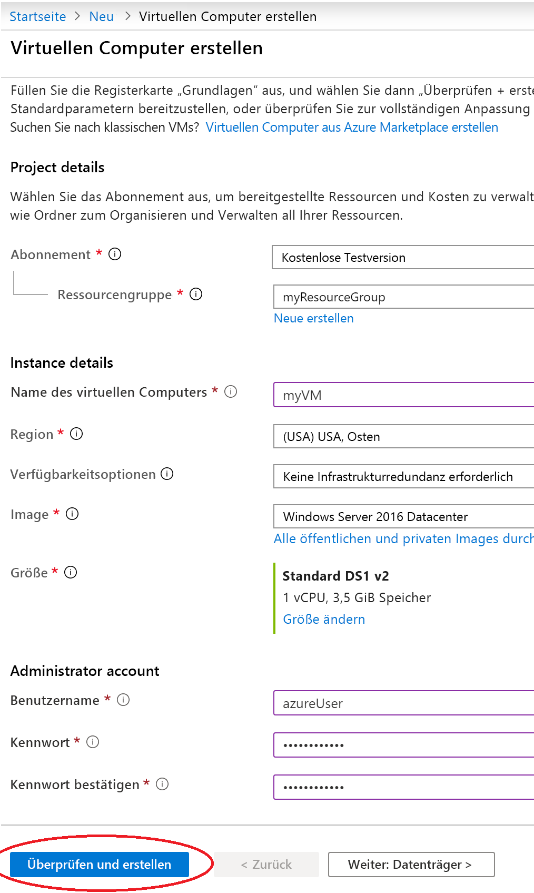
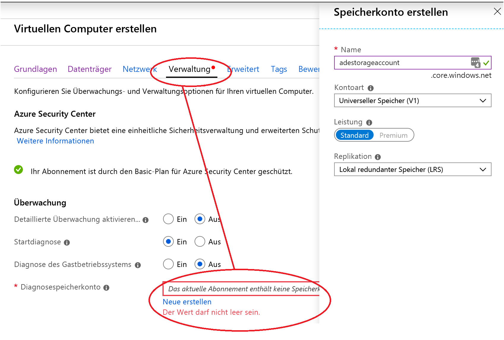
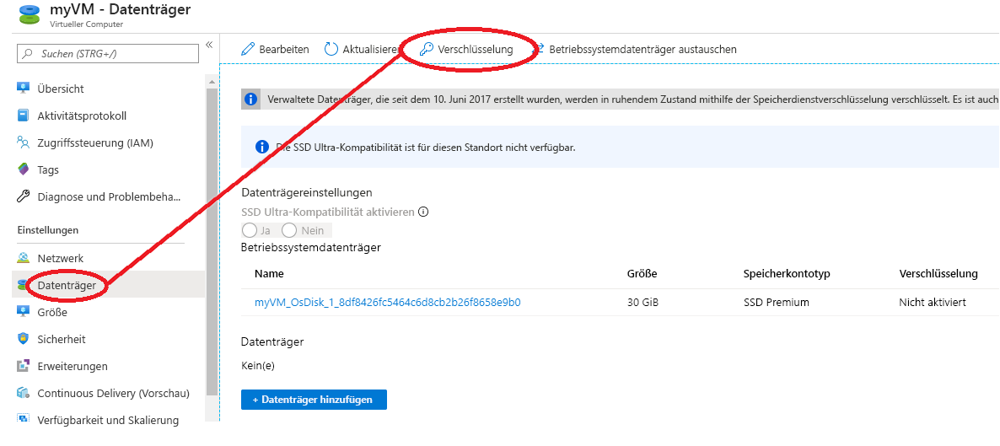
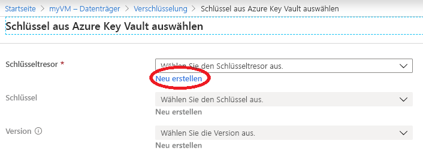
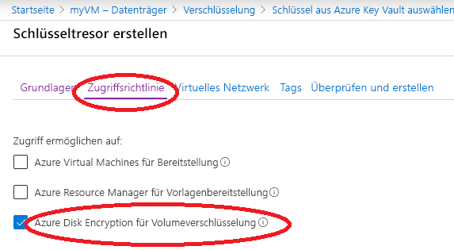

# Schnellstart: Erstellen und Verschlüsseln eines virtuellen Windows-Computers mit dem Azure-Portal

Virtuelle Azure-Computer (VMs) können über das Azure-Portal erstellt werden. Das Azure-Portal ist eine browserbasierte Benutzeroberfläche, über die Sie virtuelle Computer und die dazugehörigen Ressourcen erstellen können. In dieser Schnellstartanleitung verwenden Sie das Azure-Portal, um einen virtuellen Windows-Computer (VM) unter Ubuntu 18.04 LTS bereitzustellen, einen Schlüsseltresor zum Speichern von Verschlüsselungsschlüsseln zu erstellen und den virtuellen Computer zu verschlüsseln.

Wenn Sie kein Azure-Abonnement besitzen, können Sie ein [kostenloses Konto](https://azure.microsoft.com/free/?WT.mc_id=A261C142F) erstellen, bevor Sie beginnen.

## Anmelden bei Azure

Melden Sie sich beim [Azure-Portal](https://portal.azure.com) an.

## Erstellen eines virtuellen Computers

1. Klicken Sie links oben im Azure-Portal auf **Ressource erstellen**.
1. Wählen Sie auf der Seite „Neu“ unter „Beliebt“ die Option **Windows Server 2016 Datacenter** aus.
1. Stellen Sie auf der Registerkarte „Grundlagen“ unter „Projektdetails“ sicher, dass das richtige Abonnement ausgewählt ist, und wählen Sie dann **Neue Ressourcengruppe erstellen** aus. Geben Sie als Name *myResourceGroup* ein.
1. Geben Sie unter **Name des virtuellen Computers** den Namen *MyVM* ein.
1. Wählen Sie unter **Region** die Region aus, die Sie auch oben beim Erstellen Ihres Schlüsseltresors verwendet haben (z. B. *USA, Osten*).
1. Stellen Sie sicher, dass als **Größe** die Option *Standard D2s v3* festgelegt ist.
1. Wählen Sie unter **Administratorkonto** die Option **Kennwort** aus. Geben Sie einen Benutzernamen und ein Kennwort ein.
    
1. Wählen Sie die Registerkarte „Verwaltung“ aus, und vergewissern Sie sich, dass Sie ein Diagnosespeicherkonto besitzen. Falls Sie keine Speicherkonten besitzen, wählen Sie „Neu erstellen“ aus, geben Sie einen Namen für Ihr Konto ein, und wählen Sie „OK“ aus. 
1. Klicken Sie auf „Überprüfen und erstellen“.
1. Auf der Seite zum **Erstellen eines virtuellen Computers** werden die Details des virtuellen Computers angezeigt, den Sie erstellen möchten. Klicken Sie auf **Erstellen**, wenn Sie so weit sind.

Die Bereitstellung des virtuellen Computers dauert ein paar Minuten. Fahren Sie nach Abschluss der Bereitstellung mit dem nächsten Abschnitt fort.

## Verschlüsseln des virtuellen Computers

1. Wählen Sie nach Abschluss der Bereitstellung des virtuellen Computers die Option **Zu Ressource wechseln** aus.
1. Wählen Sie auf der linken Seitenleiste **Datenträger** aus.
1. Wählen Sie auf dem Bildschirm „Datenträger“ die Option **Verschlüsselung** aus. 

    

1. Wählen Sie auf dem Bildschirm „Verschlüsselung“ unter **Disks to encrypt** (Zu verschlüsselnde Datenträger) die Option **Datenträger für Betriebssystem und Daten** aus.
1. Wählen Sie unter **Verschlüsselungseinstellungen** die Option **Wählen Sie einen Schlüsseltresor und einen Schlüssel für die Verschlüsselung aus** aus.
1. Wählen Sie im Fenster zum **Auswählen des Schlüssels aus Azure Key Vault** die Option **Neue erstellen** aus.

    

1. Stellen Sie im Fenster **Schlüsseltresor erstellen** sicher, dass dieselbe Ressourcengruppe angegeben ist, die Sie zum Erstellen der VM verwendet haben.
1. Geben Sie Ihrem Schlüsseltresor einen Namen.  Jeder Schlüsseltresor in Azure muss einen eindeutigen Namen haben.
1. Aktivieren Sie auf der Registerkarte **Zugriffsrichtlinien** das Kontrollkästchen **Azure Disk Encryption für Volumeverschlüsselung**.

    

1. Klicken Sie auf **Überprüfen + erstellen**.  
1. Nachdem der Schlüsseltresor die Überprüfung bestanden hat, wählen Sie **Erstellen** aus. Sie gelangen zurück zum Fenster zum **Auswählen eines Schlüssels aus Azure Key Vault**.
1. Lassen Sie das Feld **Schlüssel** leer, und wählen Sie **Auswählen** aus.
1. Klicken Sie oben im Verschlüsselungsfenster auf **Speichern**. In einem Popup werden Sie gewarnt, dass der virtuelle Computer neu gestartet wird. Klicken Sie auf **Ja**.

## Bereinigen von Ressourcen

Wenn Ressourcengruppe, virtueller Computer und alle zugehörigen Ressourcen nicht mehr benötigt werden, können Sie sie löschen. Wählen Sie dazu die Ressourcengruppe für den virtuellen Computer und dann „Löschen“ aus, und bestätigen Sie den Namen der zu löschenden Ressourcengruppe.

## Nächste Schritte

In dieser Schnellstartanleitung haben Sie einen Schlüsseltresor, der für Verschlüsselungsschlüssel aktiviert wurde, und einen virtuellen Computer erstellt und den virtuellen Computer für die Verschlüsselung aktiviert.  

> [!div class="nextstepaction"]
> [Übersicht über Azure Disk Encryption](disk-encryption-overview.md)
