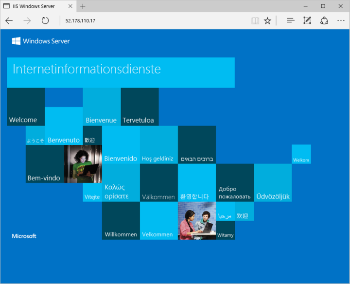

# <a name="quickstart-create-a-windows-virtual-machine-with-the-azure-cli"></a>Schnellstart: Erstellen einer Windows-VM mit der Azure CLI

Die Azure CLI dient zum Erstellen und Verwalten von Azure-Ressourcen über die Befehlszeile oder mit Skripts. In diesem Schnellstart wird gezeigt, wie Sie mithilfe der Azure-Befehlszeilenschnittstelle einen virtuellen Computer mit Windows Server 2016 in Azure bereitstellen. Wenn Sie den virtuellen Computer in Aktion sehen möchten, stellen Sie anschließend eine RDP-Verbindung mit dem virtuellen Computer her und installieren den IIS-Webserver.

Wenn Sie kein Azure-Abonnement besitzen, können Sie ein [kostenloses Konto](https://azure.microsoft.com/free/?WT.mc_id=A261C142F) erstellen, bevor Sie beginnen.

## <a name="launch-azure-cloud-shell"></a>Starten von Azure Cloud Shell

Azure Cloud Shell ist eine kostenlose interaktive Shell, mit der Sie die Schritte in diesem Artikel ausführen können. Sie verfügt über allgemeine vorinstallierte Tools und ist für die Verwendung mit Ihrem Konto konfiguriert. 

Wählen Sie zum Öffnen von Cloud Shell oben rechts in einem Codeblock einfach die Option **Ausprobieren**. Sie können Cloud Shell auch auf einer separaten Browserregisterkarte starten, indem Sie zu [https://shell.azure.com/bash](https://shell.azure.com/bash) navigieren. Wählen Sie **Kopieren** aus, um die Blöcke mit dem Code zu kopieren. Fügen Sie ihn anschließend in Cloud Shell ein, und drücken Sie die **EINGABETASTE**, um ihn auszuführen.

## <a name="create-a-resource-group"></a>Erstellen einer Ressourcengruppe

Erstellen Sie mit dem Befehl [az group create](/cli/azure/group) eine Ressourcengruppe. Eine Azure-Ressourcengruppe ist ein logischer Container, in dem Azure-Ressourcen bereitgestellt und verwaltet werden. Im folgenden Beispiel wird eine Ressourcengruppe mit dem Namen *myResourceGroup* am Standort *eastus* erstellt:

```azurecli-interactive
az group create --name myResourceGroup --location eastus
```

## <a name="create-virtual-machine"></a>Erstellen eines virtuellen Computers

Erstellen Sie mit [az vm create](/cli/azure/vm) einen virtuellen Computer. Im folgenden Beispiel wird ein virtueller Computer namens *myVM* erstellt: Dieses Beispiel verwendet *azureuser* als Administratorbenutzernamen. 

Sie müssen den Wert für `--admin-password` ändern, sonst tritt ein Fehler auf. Ändern Sie ihn in ein Kennwort, das die [Kennwortanforderungen für Azure-VMs](/azure/virtual-machines/windows/faq#what-are-the-password-requirements-when-creating-a-vm
) erfüllt. Benutzername und Kennwort werden später verwendet, wenn Sie eine Verbindung mit dem virtuellen Computer herstellen.

```azurecli-interactive
az vm create \
    --resource-group myResourceGroup \
    --name myVM \
    --image win2016datacenter \
    --admin-username azureuser \
    --admin-password myPassword
```

Das Erstellen des virtuellen Computers und der unterstützenden Ressourcen dauert einige Minuten. In der folgenden Beispielausgabe wird angezeigt, dass der Vorgang der VM-Erstellung erfolgreich war.

```azurecli-interactive
{
  "fqdns": "",
  "id": "/subscriptions/<guid>/resourceGroups/myResourceGroup/providers/Microsoft.Compute/virtualMachines/myVM",
  "location": "eastus",
  "macAddress": "00-0D-3A-23-9A-49",
  "powerState": "VM running",
  "privateIpAddress": "10.0.0.4",
  "publicIpAddress": "52.174.34.95",
  "resourceGroup": "myResourceGroup"
}
```

Beachten Sie Ihre eigene `publicIpAddress` in der Ausgabe Ihres virtuellen Computers. Diese Adresse wird in den nächsten Schritten verwendet, um auf den virtuellen Computer zuzugreifen.

## <a name="open-port-80-for-web-traffic"></a>Öffnen von Port 80 für Webdatenverkehr

Standardmäßig werden beim Erstellen eines virtuellen Windows-Computers in Azure nur RDP-Verbindungen geöffnet. Verwenden Sie [az vm open-port](/cli/azure/vm), um TCP-Port 80 für die Verwendung mit dem IIS-Webserver zu öffnen:

```azurecli-interactive
az vm open-port --port 80 --resource-group myResourceGroup --name myVM
```

## <a name="connect-to-virtual-machine"></a>Herstellen der Verbindung mit dem virtuellen Computer

Erstellen Sie mit dem folgenden Befehl auf Ihrem lokalen Computer eine Remotedesktopsitzung. Ersetzen Sie die IP-Adresse durch die öffentliche IP-Adresse Ihres virtuellen Computers. Geben Sie bei entsprechender Aufforderung die beim Erstellen des virtuellen Computers verwendeten Anmeldeinformationen ein:

```powershell
mstsc /v:publicIpAddress
```

## <a name="install-web-server"></a>Installieren des Webservers

Installieren Sie den IIS-Webserver, um den virtuellen Computer in Aktion zu sehen. Öffnen Sie eine PowerShell-Eingabeaufforderung auf dem virtuellen Computer, und führen Sie den folgenden Befehl aus:

```powershell
Install-WindowsFeature -name Web-Server -IncludeManagementTools
```

Beenden Sie anschließend die RDP-Verbindung mit dem virtuellen Computer.

## <a name="view-the-web-server-in-action"></a>Anzeigen des Webservers in Aktion

Nachdem Sie IIS installiert und Port 80 auf Ihrem virtuellen Computer für den Zugriff über das Internet geöffnet haben, können Sie einen Webbrowser Ihrer Wahl verwenden, um die IIS-Standardwillkommensseite anzuzeigen. Verwenden Sie die öffentliche IP-Adresse Ihres virtuellen Computers, die Sie in einem vorherigen Schritt abgerufen haben. Im folgenden Beispiel ist die IIS-Standardwebsite dargestellt:



## <a name="clean-up-resources"></a>Bereinigen von Ressourcen

Wenn Ressourcengruppe, virtueller Computer und alle zugehörigen Ressourcen nicht mehr benötigt werden, können Sie sie mit dem Befehl [az group delete](/cli/azure/group) entfernen:

```azurecli-interactive
az group delete --name myResourceGroup
```

## <a name="next-steps"></a>Nächste Schritte

In dieser Schnellstartanleitung haben Sie einen einfachen virtuellen Computer bereitgestellt, einen Netzwerkport für den Webdatenverkehr geöffnet und einen einfachen Webserver installiert. Fahren Sie mit dem Tutorial für virtuelle Windows-Computer fort, um weitere Informationen zu virtuellen Azure-Computern zu erhalten.

> [!div class="nextstepaction"]
> [Azure-Tutorials zu virtuellen Windows-Computern](./tutorial-manage-vm.md)
