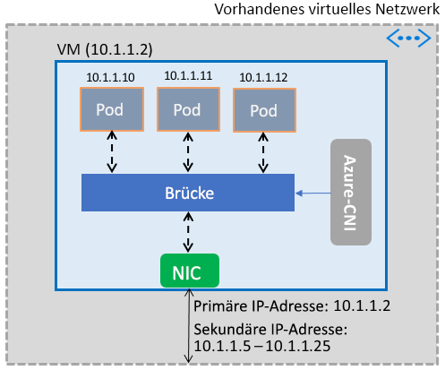

# Verwenden von Azure Virtual Network-Funktionen für Container

Nutzen Sie die umfassenden Azure-Netzwerkfunktionen in Containern, indem Sie den gleichen softwaredefinierten Netzwerkstapel wie bei virtuellen Computern verwenden. Das CNI-Plug-In (Container Network Interface) von Azure Virtual Network wird in einer Azure Virtual Machine-Instanz installiert. Das Plug-In weist Containern IP-Adressen aus einem virtuellen Netzwerk zu, die im virtuellen Computer genutzt werden, und fügt sie so an das virtuelle Netzwerk an und verbindet sie direkt mit anderen Containern und virtuellen Netzwerkressourcen. Das Plug-In ist für Verbindungen nicht auf Überlagerungsnetzwerke oder Routen angewiesen und bietet die gleiche Leistung wie virtuelle Computer. Allgemein bietet das Plug-In die folgenden Funktionen:

- Jedem Pod wird eine IP-Adresse des virtuellen Netzwerks zugewiesen, auch wenn dieser einen oder mehrere Container umfassen kann.
- Pods lassen sich mit mittels Peering verknüpften virtuellen Netzwerken und lokal über ExpressRoute oder ein Site-to-Site-VPN verbinden. Pods sind zudem über mittels Peering verknüpfte und lokale Netzwerke erreichbar.
- Pods können auf Dienste wie Azure Storage und Azure SQL-Datenbank zugreifen, die durch VNET-Dienstendpunkte geschützt sind.
- Netzwerksicherheitsgruppen und Routen können direkt auf Pods angewandt werden.
- Pods können wie virtuelle Computer direkt hinter einer internen oder externen Azure Load Balancer-Instanz platziert werden.
- Pods kann eine öffentliche IP-Adresse zugewiesen werden, sodass über das Internet direkt auf sie zugegriffen werden kann. Pods können zudem auf das Internet zugreifen.
- Es ist eine nahtlose Zusammenarbeit mit Kubernetes-Ressourcen wie z.B. Diensten, Eingangscontrollern und Kube-DNS möglich. Ein Kubernetes-Dienst kann intern oder extern über Azure Load Balancer verfügbar gemacht werden.

In der folgenden Abbildung sind die Azure Virtual Network-Funktionen dargestellt, die mit dem Plug-In für Pods bereitgestellt werden:

Das Plug-In unterstützt sowohl Linux- als auch Windows-Plattformen.

## Verbinden von Pods mit einem virtuellen Netzwerk

Pods werden in einem virtuellen Computer genutzt, der Teil eines virtuellen Netzwerks ist. Ein Pool von IP-Adressen für die Pods wird als sekundäre Adressen in der Netzwerkschnittstelle eines virtuellen Computers konfiguriert. Die grundlegende Einrichtung der Netzwerkkonnektivität für Pods und die Verwaltung der Nutzung der IP-Adressen im Pool erfolgen mit Azure CNI. Wenn ein Pod im virtuellen Computer angezeigt wird, weist Azure CNI eine verfügbare IP-Adresse aus dem Pool zu und verbindet den Pod mit einer Softwarebrücke im virtuellen Computer. Nach Beendigung des Pods wird die IP-Adresse wieder dem Pool hinzugefügt. In der folgenden Abbildung ist dargestellt, wie Pods mit einem virtuellen Netzwerk verbunden werden:

## Zugriff auf das Internet

Damit Pods auf das Internet zugreifen können, werden mit dem Plug-In *iptables*-Regeln konfiguriert, sodass eine Netzwerkadressenübersetzung (NAT) des Internetdatenverkehrs von Pods durchgeführt wird. Die IP-Quelladresse des Pakets wird in die primäre IP-Adresse in der Netzwerkschnittstelle des virtuellen Computers übersetzt. Virtuelle Windows-Computer führen automatisch eine Netzwerkadressenübersetzung für die Quelle (SNAT) des Datenverkehrs, der für IP-Adressen außerhalb des Subnetzes mit dem virtuellen Computer bestimmt ist, durch. Normalerweise wird der gesamte Datenverkehr für eine IP-Adresse außerhalb des IP-Adressbereichs des virtuellen Netzwerks übersetzt.

## Einschränkungen

Das Plug-In unterstützt bis zu 250 Pods pro virtuellem Computer und bis zu 16.000 Pods in einem virtuellen Netzwerk. Für [Azure Kubernetes Service](../azure-resource-manager/management/azure-subscription-service-limits.md?toc=%2fazure%2fvirtual-network%2ftoc.json#azure-kubernetes-service-limits) gelten andere Einschränkungen.

## Verwenden des Plug-Ins

Das Plug-In kann auf folgende Weisen verwendet werden, um grundlegende Verbindungen mit dem virtuellen Netzwerk für Pods oder Docker-Container bereitzustellen:

- **Azure Kubernetes Service:** Das Plug-In ist in Azure Kubernetes Service (AKS) integriert und kann durch Auswählen der Option *Erweiterte Funktionen für Netzwerkbetrieb und Skalierung* verwendet werden. Über „Erweiterte Funktionen für Netzwerkbetrieb und Skalierung“ können Sie einen Kubernetes-Cluster auf einem vorhandenen oder einem neuen virtuellen Netzwerk bereitstellen. Weitere Informationen zu den erweiterten Funktionen für Netzwerkbetrieb und Skalierung und den Schritten für die Einrichtung finden Sie unter [Netzwerkkonfiguration in AKS](../aks/networking-overview.md?toc=%2fazure%2fvirtual-network%2ftoc.json).
- **AKS-Engine**: Die AKS-Engine (Azure Container Service, Azure Kubernetes Service) ist ein Tool, das eine Azure Resource Manager-Vorlage zum Bereitstellen eines Kubernetes-Clusters in Azure generiert. Ausführliche Anleitungen finden Sie unter [Bereitstellen des Plug-Ins für AKS-Engine-Kubernetes-Cluster](deploy-container-networking.md#deploy-the-azure-virtual-network-container-network-interface-plug-in).
- **Erstellen Ihres eigenen Kubernetes-Clusters in Azure:** Das Plug-In kann verwendet werden, um grundlegende Netzwerkfunktionen für Pods in Kubernetes-Clustern einzurichten, die Sie selbst ohne AKS oder mit Tools wie AKS-Engine bereitstellen. In diesem Fall wird das Plug-In installiert und auf allen virtuellen Computern in einem Cluster aktiviert. Ausführliche Anweisungen finden Sie unter [Bereitstellen des Plug-Ins für einen eigenen Kubernetes-Cluster](deploy-container-networking.md#deploy-plug-in-for-a-kubernetes-cluster).
- **Verbindung mit dem virtuellen Netzwerk für Docker-Container in Azure:** Das Plug-In kann in Fällen verwendet werden, in denen Sie keinen Kubernetes-Cluster, sondern stattdessen Docker-Container mit Verbindung mit dem virtuellen Netzwerk auf virtuellen Computern erstellen möchten. Ausführliche Anleitungen finden Sie unter [Bereitstellen des Plug-Ins für Docker-Container](deploy-container-networking.md#deploy-plug-in-for-docker-containers).

## Nächste Schritte

[Bereitstellen des Plug-Ins](deploy-container-networking.md) für Kubernetes-Cluster oder Docker-Container
