# Migrieren zu Azure Virtual WAN
Mit Azure Virtual WAN können Unternehmen ihre globale Verbindungstopologie vereinfachen und von der Skalierbarkeit des globalen Netzwerks von Microsoft profitieren. Dieses Whitepaper enthält technische Details für Unternehmen, die von einer vorhandenen, kundenseitig verwalteten Hub-and-Spoke-Topologie zu einem Entwurf migrieren möchten, bei dem von Microsoft verwaltete Virtual WAN-Hubs zum Einsatz kommen.

Im Artikel [Architektur mit einem globalen Transitnetzwerk und Azure Virtual WAN](virtual-wan-global-transit-network-architecture.md) werden die Vorteile hervorgehoben, die sich durch Azure Virtual WAN für Unternehmen ergeben, die ein auf die Cloud ausgerichtetes, modernes und globales Unternehmensnetzwerk einführen.

**Abbildung 1: Azure Virtual WAN**

Das Hub-and-Spoke-Konnektivitätsmodell des virtuellen Azure-Rechenzentrums (Virtual Datacenter, VDC) wurde von Tausenden unserer Kunden eingeführt, um auf der Grundlage des standardmäßigen transitiven Routingverhaltens von Azure-Netzwerken einfache und skalierbare Cloudnetzwerke aufzubauen. Azure Virtual WAN baut auf diesen Konzepten auf und bietet neue Funktionen, die nicht nur globale Konnektivitätstopologien zwischen lokalen Standorten und Azure unterstützen, sondern den Kunden auch die Möglichkeit geben, die Skalierbarkeit des Microsoft-Netzwerks zur Erweiterung ihrer bestehenden globalen Netzwerke zu nutzen.

In diesem Artikel wird beschrieben, wie eine vorhandene Hybridumgebung zu Virtual WAN migriert wird.

## Szenario

Contoso ist eine globale Finanzorganisation mit Niederlassungen sowohl in Europa als auch in Asien. Das Unternehmen plant, seine vorhandenen Anwendungen von einem lokalen Rechenzentrum nach Azure zu verschieben und hat einen auf der VDC-Architektur basierenden Entwurf ausgearbeitet, der regionale, kundenseitig verwaltete virtuelle Hubnetzwerke für Hybridkonnektivität einschließt. Im Rahmen der Umstellung auf cloudbasierte Technologien wurde das Netzwerkteam mit der Optimierung der Konnektivität für die weitere Entwicklung des Unternehmens beauftragt.

Abbildung 2 zeigt eine allgemeine Übersicht über das vorhandene globale Netzwerk, einschließlich der Anbindung an mehrere Azure-Regionen.

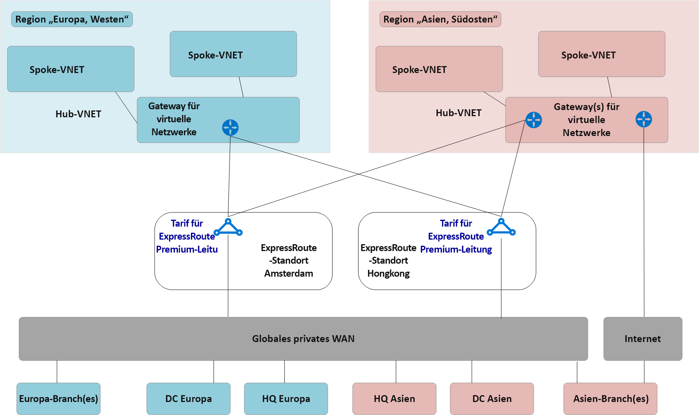
**Abbildung 2: Vorhandene Netzwerktopologie von Contoso**

Aus der vorhandenen Netzwerktopologie lassen sich folgende Punkte ableiten:
 
- Eine Hub-and-Spoke-Topologie wird in mehreren Regionen verwendet, einschließlich ExpressRoute Premium-Leitungen zur Rückverbindung mit einem allgemeinen privaten WAN.
- Einige dieser Standorte verfügen außerdem über direkte VPN-Tunnel mit Azure, um eine Kommunikation mit Anwendungen zu ermöglichen, die in der Microsoft-Cloud gehostete werden.

## Requirements (Anforderungen)
Das Netzwerkteam wurde mit der Bereitstellung eines globalen Netzwerkmodells beauftragt, das die Migration von Contoso in die Cloud unterstützen kann und eine Optimierung in Bezug auf Kosten, Skalierung und Leistung ermöglicht. Zusammengefasst müssen die folgenden Anforderungen erfüllt werden:
- Bereitstellung optimierter Pfade zu in der Cloud gehosteten Anwendungen sowohl für den Hauptstandort als auch für die Zweigstellen. 
- Beseitigung der Abhängigkeit von vorhandenen lokalen Rechenzentren zur VPN-Terminierung bei gleichzeitiger Beibehaltung der folgenden Konnektivitätspfade:
    - **Branch-to-VNET (B2V)** : Mit dem VPN verbundene Niederlassungen müssen auf Anwendungen zugreifen können, die in der lokalen Azure-Region zur Cloud migriert wurden.
    - **Branch-to-Hub-to-Hub-to-VNET (B2H2H2V)** : Mit dem VPN verbundene Niederlassungen müssen auf Anwendungen zugreifen können, die in der Azure-Remoteregion zur Cloud migriert wurden. 
    - **Branch-to-Branch (B2B)** : Regionale Niederlassungen mit VPN-Verbindung müssen untereinander und mit Haupt-/DC-Standorten mit ExpressRoute-Verbindung kommunizieren können. 
    - **Branch-to-Hub-to-Hub-to-Branch (B2H2H2B)** : Global getrennte Niederlassungen mit VPN-Verbindung müssen untereinander und mit beliebigen Haupt-/DC-Standorten mit ExpressRoute-Verbindung kommunizieren können.
    - **Branch-to-Internet (B2I)** : Verbundene Standorte müssen mit dem Internet kommunizieren können, und dieser Datenverkehr muss gefiltert und protokolliert werden.
    - **VNET-to-VNET (V2V)** : Virtuelle Spoke-Netzwerke in derselben Region müssen miteinander kommunizieren können.
    - **VNET-to-Hub-to-Hub-to-VNET (V2H2H2V)** : Virtuelle Spoke-Netzwerke in unterschiedlichen Regionen müssen miteinander kommunizieren können.
- Contoso-Roamingbenutzer (Laptop und Telefon) müssen auf Unternehmensressourcen zugreifen können, wenn sie sich nicht im Unternehmensnetzwerk befinden.

## Azure Virtual WAN-Architektur

Abbildung 3 zeigt eine allgemeine Übersicht über die aktualisierte Zieltopologie, in der die im vorherigen Abschnitt beschriebenen Anforderungen mit Azure Virtual WAN erfüllt wurden.

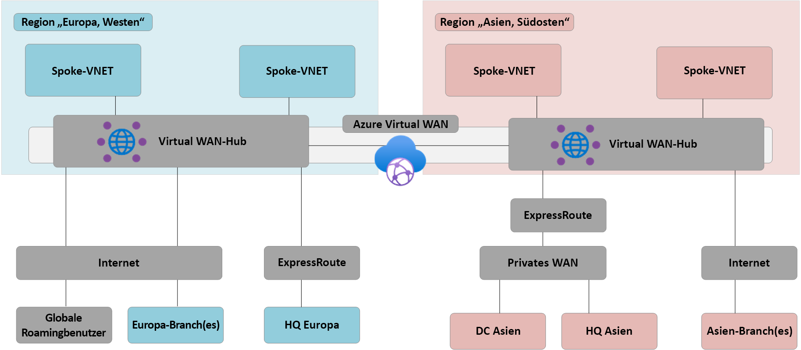
**Abbildung 3: Azure Virtual WAN-Architektur**

Zusammenfassung: 
- Der Hauptstandort in Europa bleibt über ExpressRoute verbunden, der lokale DC wird vollständig zu Azure migriert und nun außer Betrieb genommen.
- DC und Hauptstandort in Asien bleiben mit dem privatem WAN verbunden. Ab sofort wird Azure Virtual WAN zur Erweiterung des lokalen Anbieternetzwerks und zur Bereitstellung globaler Konnektivität verwendet. 
- Sowohl in der Azure-Region „Europa, Westen“ als auch in der Region „Asien, Südosten“ werden Azure Virtual WAN-Hubs eingesetzt, um Konnektivitätshubs für Geräte bereitzustellen, die über ExpressRoute und VPN verbunden sind. 
- Hubs bieten außerdem VPN-Terminierung für Roamingbenutzer für mehrere Clienttypen. Die dabei verwendete OpenVPN-Konnektivität mit dem globalen Mesh-Netzwerk ermöglicht nicht nur den Zugriff auf Anwendungen, die zu Azure migriert wurden, sondern auch auf Ressourcen, die in der lokalen Umgebung verbleiben. 
- Azure Virtual WAN stellt Internetkonnektivität für Ressourcen innerhalb eines virtuellen Netzwerks bereit. Azure Virtual WAN stellt ebenso Internetkonnektivität für Remotestandorte bereit. Durch einen lokalen Internet-Breakout via Partnerintegration wird der Zugriff auf SaaS-Dienste wie Office 365 optimiert.

## Migrieren zu Azure Virtual WAN

In diesem Abschnitt werden die verschiedenen Schritte für die Migration zu Azure Virtual WAN beschrieben.
 
### VDC-Hub-and-Spoke – Einzelregion

Die folgende Abbildung zeigt die Topologie einer einzelnen Region für Contoso vor dem Rollout von Azure Virtual WAN.

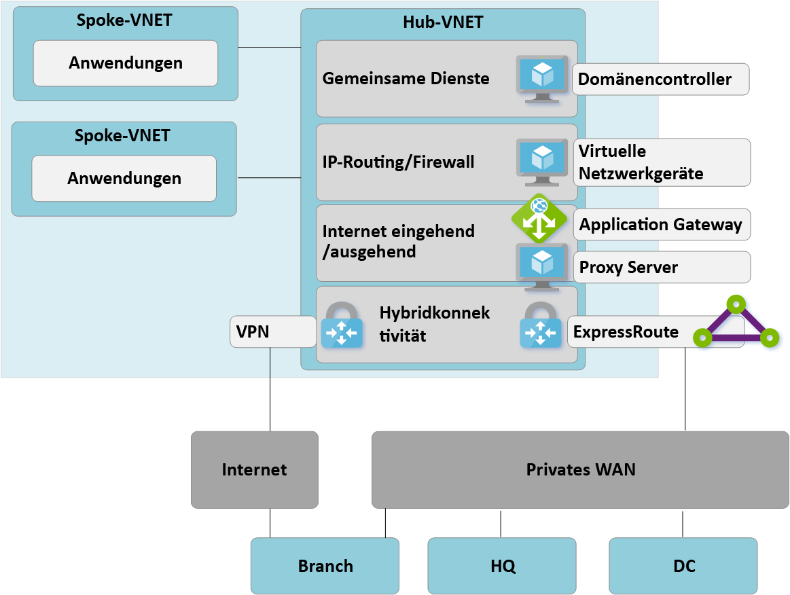

 **Abbildung 4: VDC-Hub-and-Spoke – Einzelregion – Schritt 1**

In Anlehnung an den Ansatz eines virtuellen Rechenzentrums (Virtual Data Center, VDC) umfasst das kundenseitig verwaltete virtuelle Hubnetzwerk verschiedene Funktionsblöcke:
- Gemeinsam genutzte Dienste (jede allgemeine Funktion, die von mehreren Spokes benötigt wird). Ein Verwendungsbeispiel bei Contoso sind Windows Server-Domänencontroller auf IaaS-VMs (Infrastructure-as-a-Service).
- IP-/Routingfirewalldienste werden über eine virtuelle Netzwerkappliance eines Drittanbieters bereitgestellt und ermöglichen ein Spoke-übergreifendes Layer-3-IP-Routing. 
- Dienste für eingehenden/ausgehenden Internetdatenverkehr. Hierzu zählen beispielsweise Azure Application Gateway für eingehende HTTP-Anforderungen und Proxydienste von Drittanbietern, die auf VMs ausgeführt werden und den ausgehenden Internetdatenverkehr filtern.
- ExpressRoute- und VPN-Gateway für virtuelle Netzwerke sorgt für Konnektivität mit lokalen Netzwerken.

### Bereitstellen von Virtual WAN-Hubs

Im ersten Schritt muss in jeder Region ein Virtual WAN-Hub bereitgestellt werden. Richten Sie den Virtual WAN-Hub mit einem VPN- und einem ExpressRoute-Gateway ein, wie in den folgenden Artikeln beschrieben:  
- [Tutorial: Erstellen einer Site-to-Site-Verbindung per Azure Virtual WAN](virtual-wan-site-to-site-portal.md)
- [Tutorial: Erstellen einer ExpressRoute-Zuordnung per Azure Virtual WAN](virtual-wan-expressroute-portal.md) 

> [!NOTE]
> Azure Virtual WAN muss für einige in diesem Artikel beschriebenen Datenverkehrspfade die Standard-SKU verwenden.

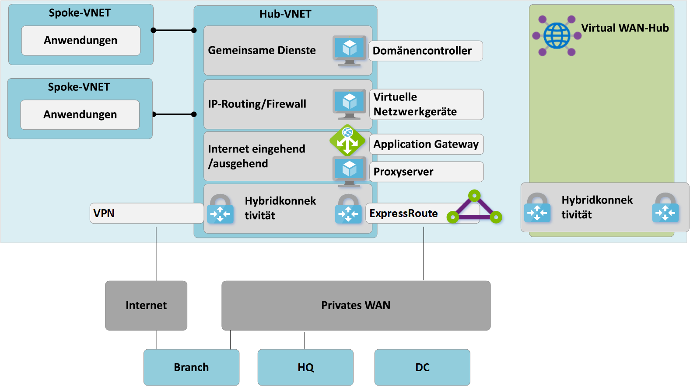
**Abbildung 5: Migration von VDC-Hub-and-Spoke zu Virtual WAN – Schritt 2**

### Verbinden von Remotestandorten (ExpressRoute und VPN) mit Virtual WAN

Nun verbinden wir den Virtual WAN-Hub mit den vorhandenen ExpressRoute-Leitungen und richten über das Internet Site-to-Site-VPN-Verbindungen mit beliebigen Remotezweigstellen ein.

> [!NOTE]
> Für eine Verbindung zum Virtual WAN-Hub müssen ExpressRoute-Leitungen auf eine Premium-SKU aktualisiert werden.

**Abbildung 6: Migration von VDC-Hub-and-Spoke zu Virtual WAN – Schritt 3**

An diesem Punkt empfangen lokale Netzwerkgeräte Routen, die dem IP-Adressraum entsprechen, der dem von Virtual WAN verwalteten Hub-VNET zugewiesen wurde. Per VPN-verbundene Remotezweigstellen sehen in dieser Phase zwei Pfade zu beliebigen vorhandenen Anwendungen in den virtuellen Spoke-Netzwerken. Diese Geräte müssen so konfiguriert werden, dass sie auch weiterhin den Tunnel zum VDC-Hub nutzen können, um während der Übergangsphase ein symmetrisches Routing zu gewährleisten.

### Testen der Hybridkonnektivität über Virtual WAN

Bevor Sie den verwalteten Virtual WAN-Hub für die Produktionskonnektivität nutzen, wird empfohlen, ein virtuelles Spoke-Netzwerk und eine Virtual WAN-VNET-Verbindung einzurichten. Stellen Sie sicher, dass die Verbindungen mit dieser Testumgebung über ExpressRoute und Site-to-Site-VPN funktionieren, bevor Sie mit den nächsten Schritten fortfahren.

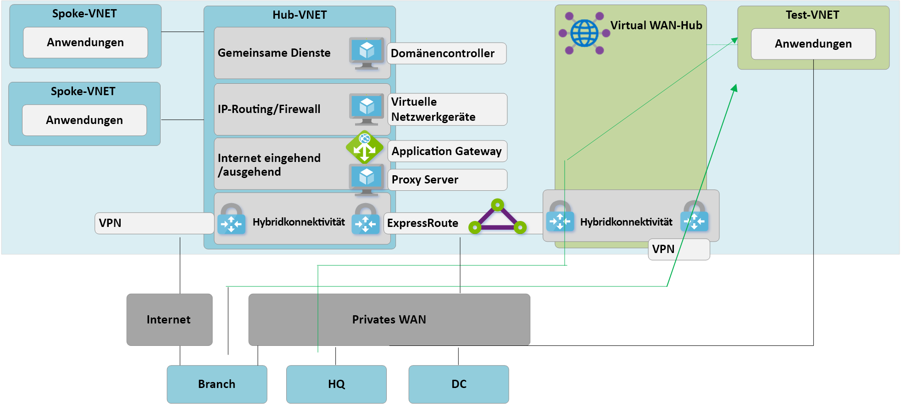
**Abbildung 7: Migration von VDC-Hub-and-Spoke zu Virtual WAN – Schritt 4**

### Umstellen der Konnektivität auf Virtual WAN-Hub

**Abbildung 8: Migration von VDC-Hub-and-Spoke zu Virtual WAN – Schritt 5**

**a**: Löschen Sie die vorhandenen Peeringverbindungen zwischen den virtuellen Spoke-Netzwerken und dem alten VDC-Hub. Der Zugriff auf Anwendungen in virtuellen Spoke-Netzwerken ist erst nach Abschluss der Schritte a bis c wieder möglich.

**b**. Verbinden Sie die virtuellen Spoke-Netzwerke über VNET-Verbindungen mit dem Virtual WAN-Hub.

**c**. Entfernen Sie alle benutzerdefinierten Routen (User-Defined Routes, UDR), die zuvor in den virtuellen Spoke-Netzwerken für die Spoke-to-Spoke-Kommunikation verwendet wurden. Dieser Pfad wird jetzt durch das dynamische Routing im Virtual WAN-Hub aktiviert.

**d**. Vorhandene ExpressRoute- und VPN-Gateways im VDC-Hub werden nun außer Betrieb genommen, um den nächsten Schritt (e) zu ermöglichen.

**e**. Verbinden Sie den alten VDC-Hub (virtuelles Hubnetzwerk) über eine neue VNET-Verbindung mit dem Virtual WAN-Hub.

### Alter Hub wird zum Spoke für gemeinsame Dienste.

Wir haben nun unser Azure-Netzwerk überarbeitet, um den Virtual WAN-Hub zum zentralen Punkt in unserer neuen Topologie zu machen.

**Abbildung 9: Migration von VDC-Hub-and-Spoke zu Virtual WAN – Schritt 6**

Da der Virtual WAN-Hub eine verwaltete Entität ist und die Bereitstellung benutzerdefinierter Ressourcen wie z. B. VMs nicht zulässt, ist der Block für gemeinsame Dienste jetzt ein virtuelles Spoke-Netzwerk, das Funktionen wie den eingehenden Internetdatenverkehr über Azure Application Gateway oder eine virtuelle Netzwerkappliance hostet. Der Datenverkehr zwischen der Umgebung für gemeinsame Dienste und virtuellen Back-End-Computern durchläuft nun den von Virtual WAN verwalteten Hub.

### Optimieren der lokalen Konnektivität zur vollständigen Nutzung von Virtual WAN

In diesem Punkt hat Contoso die Migration von Geschäftsanwendungen in die Microsoft Cloud weitgehend abgeschlossen, wobei nur noch wenige Legacyanwendungen auf dem lokalen DC verbleiben.

**Abbildung 10: Migration von VDC-Hub-and-Spoke zu Virtual WAN – Schritt 7**

 Um die vollständige Funktionalität von Azure Virtual WAN nutzen zu können, entscheidet sich Contoso dafür, die zuvor verwendeten lokalen VPN-Verbindungen außer Betrieb zu nehmen. Alle Zweigstellen, die weiterhin auf Hauptstandort- oder DC-Netzwerke zugreifen, können das globale Microsoft-Netzwerk mithilfe des integrierten Transitroutings von Azure Virtual WAN durchqueren. 

> [!NOTE]
> ExpressRoute Global Reach ist eine Alternative für Kunden, die den Microsoft-Backbone als Ergänzung ihrer vorhandenen privaten WANs nutzen möchten.

## Endzustand von Architektur und Datenverkehrspfaden

**Abbildung 11: Virtual WAN mit zwei Regionen**

Dieser Abschnitt gibt anhand einiger Beispiele für Datenverkehrsflüsse einen Überblick darüber, wie diese Topologie den ursprünglichen Anforderungen entspricht.

### Pfad 1

Pfad 1 beschreibt den Datenverkehrsfluss von einer Zweigstelle mit S2S-VPN-Verbindung in Asien zum Azure-VNET in der Region „Asien, Südosten“.

Der Datenverkehr wird wie folgt weitergeleitet:
- Die Zweigstelle in Asien ist über resiliente S2S-BGP-fähige Tunnel mit dem Virtual WAN-Hub in der Region „Asien, Südosten“ verbunden.
- Der Virtual WAN-Hub in Asien leitet Datenverkehr lokal an das verbundene VNET weiter.

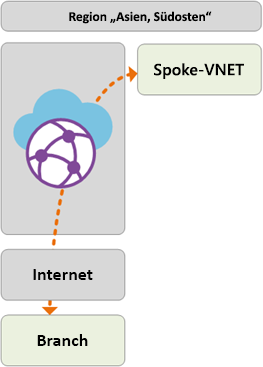

### Pfad 2
Pfad 2 beschreibt den Datenverkehrsfluss vom per ExpressRoute verbundenen Hauptstandort in Europa zum Azure-VNET in der Region „Asien, Südosten“.

Der Datenverkehr wird wie folgt weitergeleitet:
- Der Hauptstandort in Europa wird über eine ExpressRoute Premium-Verbindung mit dem Virtual WAN-Hub in der Region „Europa, Westen“ verbunden.
- Die globale Hub-zu-Hub-Konnektivität von Virtual WAN ermöglicht den Transit des Datenverkehrs an ein in der Remoteregion verbundenes VNET.

### Pfad 3
Pfad 3 beschreibt den Datenverkehrsfluss von einem lokalen, mit einem privaten WAN verbundenen DC in Asien an eine europäische Zweigstelle mit S2S-Verbindung.

Der Datenverkehr wird wie folgt weitergeleitet:
- Der DC in Asien ist mit einem Netzanbieter für das lokale private WAN verbunden.
- Die ExpressRoute-Verbindung ist lokal im privaten WAN terminiert, das mit dem Virtual WAN-Hub in der Region „Asien, Südosten“ verbunden ist.
- Die globale Hub-zu-Hub-Konnektivität von Virtual WAN ermöglicht den Transit des Datenverkehrs.

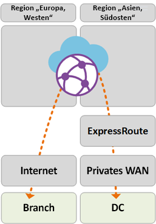

### Pfad 4
Pfad 4 beschreibt den Datenverkehrsfluss von einem Azure-VNET in der Region „Asien, Südosten“ zu einem Azure-VNET in der Region „Europa, Westen“.

Der Datenverkehr wird wie folgt weitergeleitet:
- Die globale Hub-to-Hub-Konnektivität von Virtual WAN ermöglicht einen nativen Transit für alle verbundenen Azure-VNETs, ohne dass eine weitere Benutzerkonfiguration erforderlich ist.

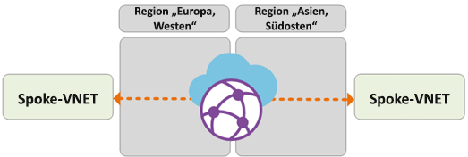

### Pfad 5
Pfad 5 beschreibt den Datenverkehrsfluss vom Roaming-VPN-Benutzer (P2S) zu einem Azure-VNET in der Region „Europa, Westen“.

Der Datenverkehr wird wie folgt weitergeleitet:
- Laptop- und Mobilgerätebenutzer nutzen den OpenVPN-Client für eine transparente Konnektivität mit dem P2S-VPN-Gateway in der Region „Europa, Westen“.
- Der Virtual WAN-Hub in der Region „Europa, Westen“ leitet Datenverkehr lokal an das verbundene VNET weiter.

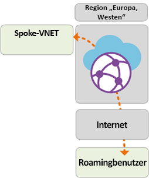

## Sicherheits- und Richtliniensteuerung über Azure Firewall

Contoso hat nun die Konnektivität zwischen allen Zweigstellen und VNETs gemäß den zuvor in diesem Dokument beschriebenen Anforderungen sichergestellt. Um die geltenden Anforderungen in Bezug auf Sicherheitssteuerung und Netzwerkisolierung zu erfüllen, muss das Unternehmen den Datenverkehr weiterhin über das Hubnetzwerk trennen und protokollieren. Bisher wurde diese Funktion von einer virtuellen Netzwerkappliance (NVA) übernommen. Außerdem möchte Contoso die vorhandenen Proxydienste außer Betrieb nehmen und native Azure-Dienste für die Filterung des ausgehenden Datenverkehrs nutzen. 

**Abbildung 12: Azure Firewall in Virtual WAN (geschützter virtueller Hub)**

Die folgenden allgemeinen Schritte sind für die Einführung von Azure Firewall in den Virtual WAN-Hubs erforderlich, um einen einheitlichen Ausgangspunkt für die Richtliniensteuerung zu ermöglichen. Dieser Vorgang und das Konzept der geschützten virtuellen Hubs werden [hier](https://go.microsoft.com/fwlink/?linkid=2107683) ausführlich erläutert.
- Erstellen Sie eine Azure Firewall-Richtlinie.
- Verknüpfen Sie die Firewallrichtlinie mit dem Azure Virtual WAN-Hub.
- Durch den obigen Schritt kann der vorhandene Virtual WAN-Hub als geschützter virtueller Hub fungieren und die erforderlichen Azure Firewall-Ressourcen bereitstellen.

> [!NOTE]
> Folgendes gilt, wenn Azure Firewall in einem Virtual WAN Standard-Hub bereitgestellt wird (SKU: Standard): V2V-, B2V-, V2i-und B2I-FW-Richtlinien werden nur für den Datenverkehr erzwungen, der aus den VNETs und Zweigstellen stammt, die mit einem bestimmten Hub verbunden sind, auf dem Azure FW bereitgestellt wird (geschützter Hub). Datenverkehr, der von Remote-VNETs und -Zweigstellen stammt, die mit anderen Virtual WAN-Hubs in derselben Virtual WAN-Instanz verbunden sind, wird nicht durch eine Firewall geschützt, obwohl diese Remotezweigstellen und VNETs über Virtual WAN-H2H-Verbindungen miteinander verbunden sind. Die Unterstützung für eine hubübergreifende Firewall ist Teil der Roadmap von Azure Virtual WAN und Firewall Manager.

Die folgenden Pfade beschreiben die Konnektivitätspfade, die durch die Verwendung von geschützten virtuellen Azure-Hubs aktiviert werden.

### Pfad 6
Pfad 6 beschreibt den sicheren Datenverkehrsfluss für VNETs in derselben Region.

Der Datenverkehr wird wie folgt weitergeleitet:
- Virtuelle Netzwerke, die mit demselben geschützten virtuellen Hub verbunden sind, leiten nun Datenverkehr über Azure Firewall weiter.
- Azure Firewall kann eine Richtlinie auf diese Datenflüsse anwenden.

### Pfad 7
Pfad 7 beschreibt den Datenverkehrsfluss von einem Azure-VNET zum Internet oder an den Sicherheitsdienst eines Drittanbieters.

Der Datenverkehr wird wie folgt weitergeleitet:
- Virtuelle Netzwerke, die mit dem geschützten virtuellen Hub verbunden sind, können den Datenverkehr an öffentliche Ziele im Internet senden, indem sie den geschützten Hub als zentralen Punkt für den Internetzugang verwenden.
- Dieser Datenverkehr kann lokal mithilfe von Azure Firewall-FQDN-Regeln gefiltert oder zur Überprüfung an einen Sicherheitsdienst eines Drittanbieters gesendet werden.

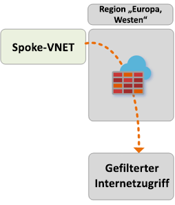

### Pfad 8
Pfad 8 beschreibt den Datenfluss von der Zweigstelle zum Internet oder an den Sicherheitsdienst eines Drittanbieters.

Der Datenverkehr wird wie folgt weitergeleitet:
- Zweigstellen, die mit dem geschützten virtuellen Hub verbunden sind, können den Datenverkehr an öffentliche Ziele im Internet senden, indem sie den geschützten Hub als zentralen Punkt für den Internetzugang verwenden.
- Dieser Datenverkehr kann lokal mithilfe von Azure Firewall-FQDN-Regeln gefiltert oder zur Überprüfung an einen Sicherheitsdienst eines Drittanbieters gesendet werden.

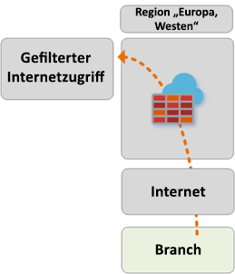 

## Nächste Schritte
Erfahren Sie mehr über [Azure Virtual WAN](virtual-wan-about.md).
