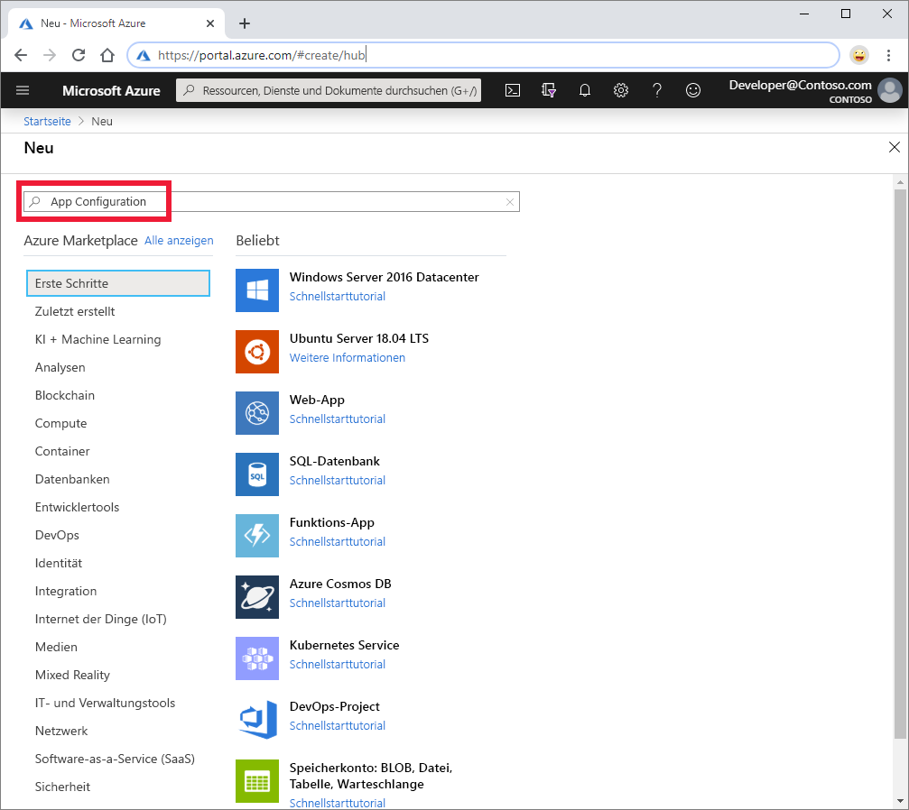
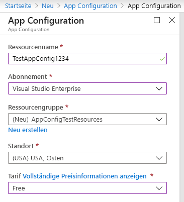

1. Melden Sie sich beim [Azure-Portal](https://portal.azure.com) an, um einen neuen App Configuration-Speicher zu erstellen. Wählen Sie links oben auf der Startseite die Option **Ressource erstellen** aus. Geben Sie im Feld **Marketplace durchsuchen** den Suchbegriff **App Configuration** ein, und drücken Sie die EINGABETASTE.

    

1. Wählen Sie **App Configuration** in den Suchergebnissen und dann **Erstellen** aus.

    

1. Geben Sie im Bereich **App Configuration** > **Erstellen** die folgenden Einstellungen ein:

    | Einstellung | Vorgeschlagener Wert | Beschreibung |
    |---|---|---|
    | **Ressourcenname** | Global eindeutiger Name | Geben Sie einen eindeutigen Ressourcennamen ein, der für die App Configuration-Speicherressource verwendet werden soll. Der Name muss zwischen 1 und 63 Zeichen lang sein und darf nur Zahlen, Buchstaben und das Zeichen `-` enthalten. Der Name darf weder mit dem Zeichen `-` beginnen oder enden noch mehrere aufeinanderfolgende Zeichen vom Typ `-` enthalten.  |
    | **Abonnement** | Ihr Abonnement | Wählen Sie das Azure-Abonnement aus, das Sie zum Testen von App Configuration verwenden möchten. Wenn das Konto nur ein einziges Abonnement umfasst, wird automatisch dieses Abonnement ausgewählt, und die Dropdownliste **Abonnement** wird nicht angezeigt. |
    | **Ressourcengruppe** | *AppConfigTestResources* | Wählen Sie eine Ressourcengruppe für Ihre App Configuration-Speicherressource aus, oder erstellen Sie eine Ressourcengruppe. Diese Gruppe ist beim Organisieren mehrerer Ressourcen hilfreich, die Sie möglicherweise zur gleichen Zeit löschen möchten, indem Sie die Ressourcengruppe löschen. Weitere Informationen finden Sie unter [Verwenden von Ressourcengruppen zum Verwalten von Azure-Ressourcen](/azure/azure-resource-manager/resource-group-overview). |
    | **Location** | *USA (Mitte)* | Verwenden Sie **Standort**, um den geografischen Standort anzugeben, an dem Ihr App-Konfigurationsspeicher gehostet wird. Erstellen Sie die Ressource in derselben Region wie andere Komponenten Ihrer Anwendung, um eine optimale Leistung zu erzielen. |

    

1. Klicken Sie auf **Erstellen**. Die Bereitstellung kann einige Minuten dauern.

1. Wählen Sie nach Abschluss der Bereitstellung **Einstellungen** > **Zugriffsschlüssel** aus. Notieren Sie sich die schreibgeschützte Primärschlüssel-Verbindungszeichenfolge. Diese Verbindungszeichenfolge verwenden Sie später zum Konfigurieren Ihrer Anwendung für die Kommunikation mit dem erstellten App Configuration-Speicher.
