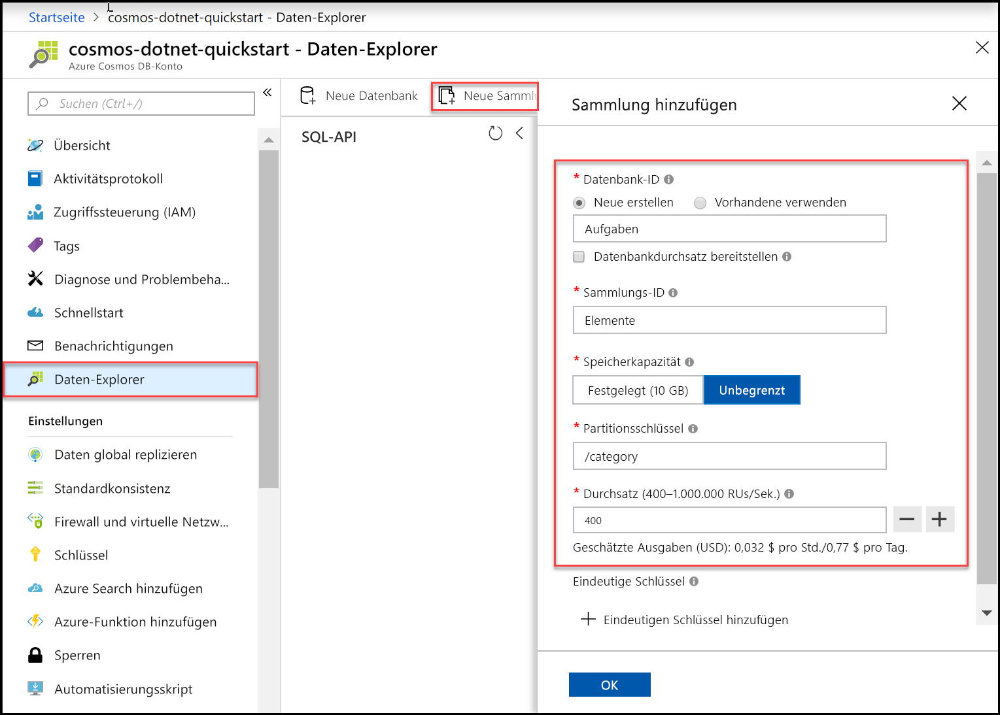

Sie können nun mithilfe des Daten-Explorer-Tools im Azure-Portal eine Datenbank und eine Sammlung erstellen. 

1. Klicken Sie auf **Daten-Explorer** > **Neue Sammlung**. 
    
    Der Bereich **Sammlung hinzufügen** wird ganz rechts angezeigt. Möglicherweise müssen Sie nach rechts scrollen, damit Sie ihn sehen.

    

2. Geben Sie auf der Seite **Sammlung hinzufügen** die Einstellungen für die neue Sammlung ein.

    Einstellung|Empfohlener Wert|BESCHREIBUNG
    ---|---|---
    Datenbank-ID|*Aufgaben*|Geben Sie *Tasks* als Namen für die neue Datenbank ein. Datenbanknamen müssen zwischen 1 und 255 Zeichen lang sein und dürfen weder /, \\, #, ? noch nachgestellte Leerzeichen enthalten.
    Sammlungs-ID|*Elemente*|Geben Sie *Items* als Namen für die neue Sammlung ein. Für Sammlungs-IDs gelten dieselben Zeichenanforderungen wie für Datenbanknamen.
    Bereitstellen des Datenbankdurchsatzes|Nicht ausfüllen|Azure Cosmos DB kann Durchsatz entweder auf Datenbankebene (alle Sammlungen in einer Datenbank haben den gleichen Durchsatz) oder auf Sammlungsebene bereitstellen. Lassen Sie die Einstellung leer, um für diese bestimmte Sammlung Durchsatz auf Sammlungsebene bereitzustellen.
    Speicherkapazität|*Unbegrenzt*|Wählen Sie als Speicherkapazität **Unbegrenzt** aus. 
    Partitionsschlüssel|*/category*|Geben Sie „/category“ als Partitionsschlüssel ein. Indem Sie einen Partitionsschlüssel festlegen, kann Azure Cosmos DB Ihre Sammlung skalieren, um die Speicher- und Durchsatzanforderungen Ihrer Anwendung zu erfüllen. Im Allgemeinen wird ein Partitionsschlüssel empfohlen, der eine Vielzahl unterschiedlicher Werte umfasst und eine gleichmäßige Verteilung des Speicher- und Anforderungsvolumens in Ihrer Workload bewirkt. [Weitere Informationen zur Partitionierung](../articles/cosmos-db/partitioning-overview.md)
    Throughput|*400 RU/s*|Ändern Sie den Durchsatz in 400 Anforderungseinheiten pro Sekunde (RU/s). Sie können den Durchsatz später zentral hochskalieren, wenn Sie Wartezeiten reduzieren möchten. 
    
    Zusätzlich zu den zuvor beschriebenen Einstellungen können Sie optional auch **eindeutige Schlüssel** für die Sammlung hinzufügen. In diesem Beispiel lassen wir das Feld leer. Eindeutige Schlüssel bieten Entwicklern die Möglichkeit, ihrer Datenbank eine zusätzliche Datenintegritätsebene hinzuzufügen. Durch das Erstellen einer Richtlinie für eindeutige Schlüssel beim Erstellen einer Sammlung wird die Eindeutigkeit von einem oder mehreren Werten pro Partitionsschlüssel gewährleistet. Weitere Informationen finden Sie im Artikel [Eindeutige Schlüssel in Azure Cosmos DB](../articles/cosmos-db/unique-keys.md).
    
    Klicken Sie auf **OK**.

    Im Daten-Explorer werden die neue Datenbank und die neue Sammlung angezeigt.

    