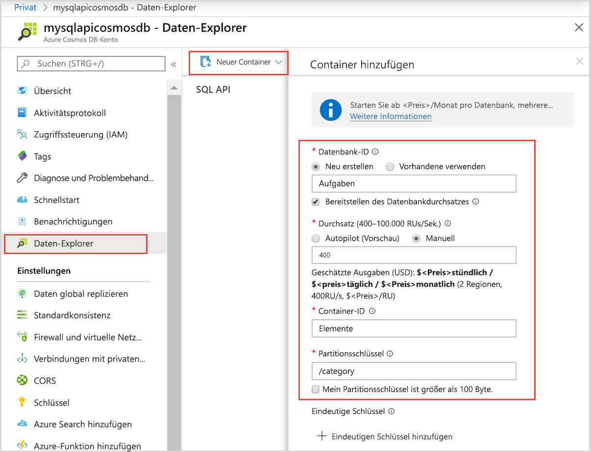

Sie können nun mithilfe des Daten-Explorer-Tools im Azure-Portal eine Datenbank und eine Sammlung erstellen. 

1. Klicken Sie auf **Daten-Explorer** > **Neue Sammlung**. 
    
    Der Bereich **Sammlung hinzufügen** wird ganz rechts angezeigt. Möglicherweise müssen Sie nach rechts scrollen, damit Sie ihn sehen.

    

2. Geben Sie auf der Seite **Sammlung hinzufügen** die Einstellungen für die neue Sammlung ein.

    Einstellung|Empfohlener Wert|Beschreibung
    ---|---|---
    Datenbank-ID|Aufgaben|Geben Sie *Tasks* als Namen für die neue Datenbank ein. Datenbanknamen müssen zwischen 1 und 255 Zeichen lang sein und dürfen weder /, \\, #, ? noch nachgestellte Leerzeichen enthalten.
    Sammlungs-ID|Items|Geben Sie *Items* als Namen für die neue Sammlung ein. Für Sammlungs-IDs gelten dieselben Zeichenanforderungen wie für Datenbanknamen.
    Speicherkapazität| Fixed (10 GB)|Ändern Sie den Wert in **Fest (10 GB)**. Dieser Wert gibt die Speicherkapazität der Datenbank an.
    Durchsatz|400 RU|Ändern Sie den Durchsatz in 400 Anforderungseinheiten pro Sekunde (RU/s). Die Speicherkapazität muss auf **Fest (10 GB)** festgelegt werden, um den Durchsatz auf 400 RU/s einzustellen. Sie können den Durchsatz später zentral hochskalieren, wenn Sie Wartezeiten reduzieren möchten. 
    Partitionsschlüssel|/category|Geben Sie */category* als Partitionsschlüssel ein. Ein Partitionsschlüssel verteilt Daten gleichmäßig auf alle Partitionen in der Datenbank. Weitere Informationen zur Partitionierung finden Sie unter [Entwerfen für Partitionierung](../articles/cosmos-db/partition-data.md#designing-for-partitioning).

    Klicken Sie auf **OK**.

    Im Daten-Explorer werden die neue Datenbank und die neue Sammlung angezeigt.

    