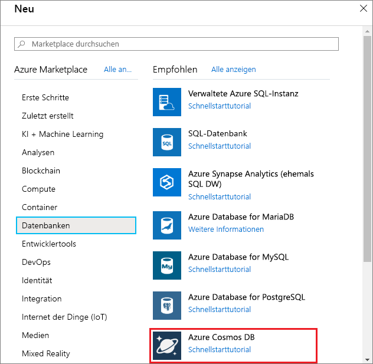
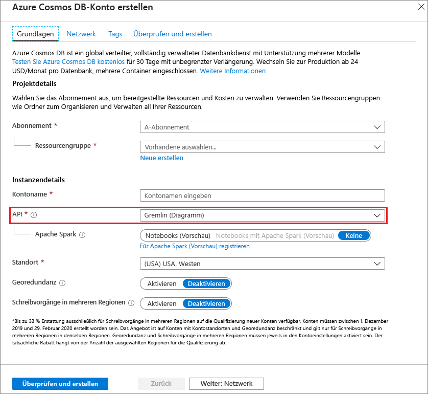
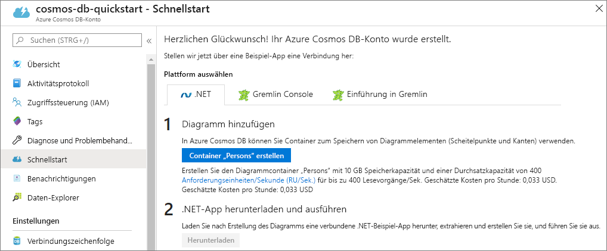

1. Melden Sie sich in einem neuen Browserfenster beim [Azure-Portal](https://portal.azure.com/) an.

2. Klicken Sie auf **Ressourcen erstellen** > **Datenbanken** > **Azure Cosmos DB**.
   
   

3. Geben Sie auf der Seite **Azure Cosmos DB-Konto erstellen** die Einstellungen für das neue Azure Cosmos DB-Konto ein. 

    Einstellung|Wert|BESCHREIBUNG
    ---|---|---
    Abonnement|Ihr Abonnement|Wählen Sie das Azure-Abonnement aus, das Sie für dieses Azure Cosmos DB-Konto verwenden möchten. 
    Ressourcengruppe|Neu erstellen  Derselbe eindeutige Name wie für die ID|Wählen Sie **Neu erstellen**. Geben Sie dann einen neuen Ressourcengruppenname für Ihr Konto ein. Verwenden Sie der Einfachheit halber denselben Namen wie bei Ihrer ID. 
    Kontoname|Geben Sie einen eindeutigen Namen ein.|Geben Sie einen eindeutigen Namen ein, der Ihr Azure Cosmos DB-Konto identifiziert. Da *documents.azure.com* an die ID angefügt wird, die Sie für die URI-Erstellung angeben, muss die ID eindeutig sein.  Die ID darf nur Kleinbuchstaben, Zahlen und den Bindestrich (-) enthalten. Sie muss zwischen 3 und 31 Zeichen lang sein.
    API|Gremlin (Graph)|Die API bestimmt den Typ des zu erstellenden Kontos. Azure Cosmos DB stellt fünf APIs bereit: Core (SQL)-API für Dokumentdatenbanken, Gremlin-API für Graphdatenbanken, MongoDB-API für Dokumentdatenbanken, Azure Table und Cassandra. Derzeit müssen Sie ein separates Konto für jede API erstellen.   Wählen Sie **Gremlin (graph)** aus, da Sie mit dieser Schnellstartanleitung eine Tabelle erstellen, die mit der Gremlin-API verwendet werden kann.   [Erfahren Sie mehr über die Graph-API](../articles/cosmos-db/graph-introduction.md).|
    Location|Wählen Sie die Region aus, die Ihren Benutzern am nächsten liegt.|Wählen Sie einen geografischen Standort aus, an dem Ihr Azure Cosmos DB-Konto gehostet werden soll. Verwenden Sie einen Standort, der Ihren Benutzern am nächsten liegt, um ihnen einen schnellen Zugriff auf die Daten zu gewähren.

    Wählen Sie **Bewerten + erstellen** aus. Sie können die Abschnitte **Netzwerk** und **Tags** überspringen. 

    

4. Die Kontoerstellung dauert einige Minuten. Warten Sie, bis das Portal die Seite **Herzlichen Glückwunsch! Ihr Azure Cosmos DB-Konto wurde erstellt** anzeigt.

    