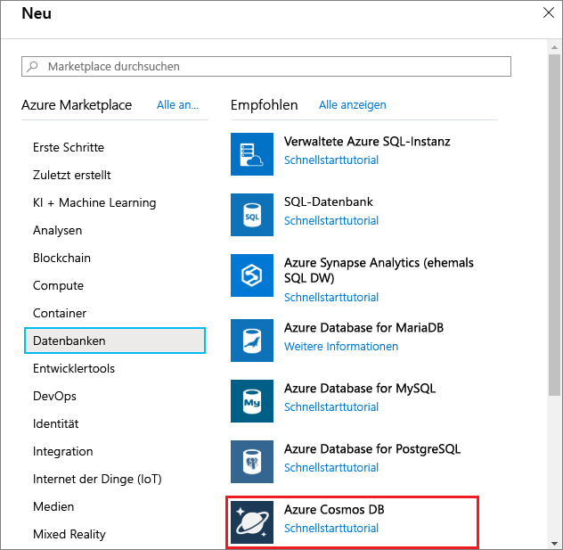

1. Melden Sie sich in einem neuen Fenster beim [Azure-Portal](https://portal.azure.com/) an.
2. Klicken Sie im linken Menü auf **Ressource erstellen** > **Datenbanken** und anschließend unter **Azure Cosmos DB** auf **Erstellen**.
   
   

3. Geben Sie auf dem Blatt **Neues Konto** als API die Option **MongoDB** an, und legen Sie die gewünschte Konfiguration für das Azure Cosmos DB-Konto fest.
 
    

    * Bei der **ID** muss es sich um einen eindeutigen Namen handeln, den Sie für die Identifikation Ihres Azure Cosmos DB-Kontos verwenden möchten. Die ID darf nur Kleinbuchstaben, Ziffern und Bindestriche enthalten und muss zwischen drei und 50 Zeichen lang sein.
    * **Abonnement** ist Ihr Azure-Abonnement. Diese Angabe wird automatisch ausgefüllt.
    * **Ressourcengruppe** ist der Ressourcengruppenname für Ihr Azure Cosmos DB-Konto.
    * **Standort** ist der geografische Ort, an dem sich Ihre Azure Cosmos DB-Instanz befindet. Wählen Sie den Standort aus, der Ihren Benutzern am nächsten ist.

4. Klicken Sie auf **Erstellen** , um das Konto zu erstellen.
5. Klicken Sie in der Symbolleiste auf **Benachrichtigungen**, um den Bereitstellungsprozess zu überwachen.

    

6.  Wenn die Bereitstellung abgeschlossen wurde, öffnen Sie das neue Konto über die Kachel „Alle Ressourcen“. 

    
