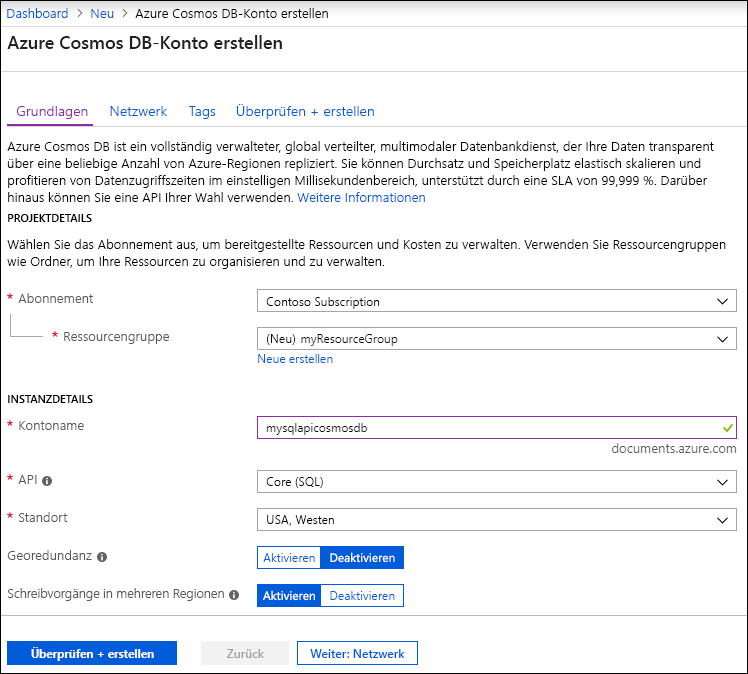
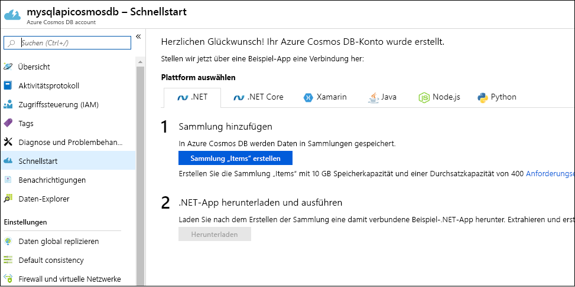

1. Melden Sie sich beim [Azure-Portal](https://portal.azure.com/) an.
1. Wählen Sie **Ressourcen erstellen** > **Datenbanken** > **Azure Cosmos DB** aus.

   

1. Geben Sie auf der Seite **Azure Cosmos DB-Konto erstellen** die grundlegenden Einstellungen für das neue Azure Cosmos-Konto ein. 

    |Einstellung|Wert|BESCHREIBUNG |
    |---|---|---|
    |Subscription|Abonnementname|Wählen Sie das Azure-Abonnement aus, das Sie für dieses Azure Cosmos-Konto verwenden möchten. |
    |Ressourcengruppe|Ressourcengruppenname|Wählen Sie eine Ressourcengruppe aus, oder wählen Sie **Neu erstellen** aus, und geben Sie einen eindeutigen Namen für die Ressourcengruppe ein. |
    |Kontoname|Ein eindeutiger Name|Geben Sie einen Namen ein, der Ihr Azure Cosmos-Konto identifiziert. Da *documents.azure.com* an die ID angefügt wird, die Sie für die URI-Erstellung angeben, muss die ID eindeutig sein.  Die ID darf nur Kleinbuchstaben, Zahlen und den Bindestrich (-) enthalten. Sie muss zwischen drei und 31 Zeichen lang sein.|
    |API|Der Typ des zu erstellenden Kontos|Wählen Sie **Core (SQL)** aus, um eine Dokumentdatenbank und eine Abfrage mit SQL-Syntax zu erstellen.   Die API bestimmt den Typ des zu erstellenden Kontos. Azure Cosmos DB stellt fünf APIs bereit: Core (SQL) und MongoDB für Dokumentdaten, Gremlin für Diagrammdaten sowie Azure Table und Cassandra. Derzeit müssen Sie ein separates Konto für jede API erstellen.   [Weitere Informationen zur SQL-API](../articles/cosmos-db/documentdb-introduction.md)|
    |Location|Die Region, die Ihren Benutzern am nächsten liegt|Wählen Sie einen geografischen Standort aus, an dem Ihr Azure Cosmos DB-Konto gehostet werden soll. Verwenden Sie den Standort, der Ihren Benutzern am nächsten ist, damit sie möglichst schnell auf die Daten zugreifen können.|

   

1. Klicken Sie auf **Überprüfen + erstellen**. Sie können die Abschnitte **Netzwerk** und **Tags** überspringen.

1. Überprüfen Sie die Kontoeinstellungen, und wählen Sie anschließend **Erstellen** aus. Die Erstellung des Kontos dauert einige Minuten. Warten Sie, bis auf der Portalseite **Ihre Bereitstellung wurde abgeschlossen.** angezeigt wird. 

    

1. Wählen Sie **Zu Ressource wechseln** aus, um zur Seite des Azure Cosmos DB-Kontos zu wechseln. 

    
