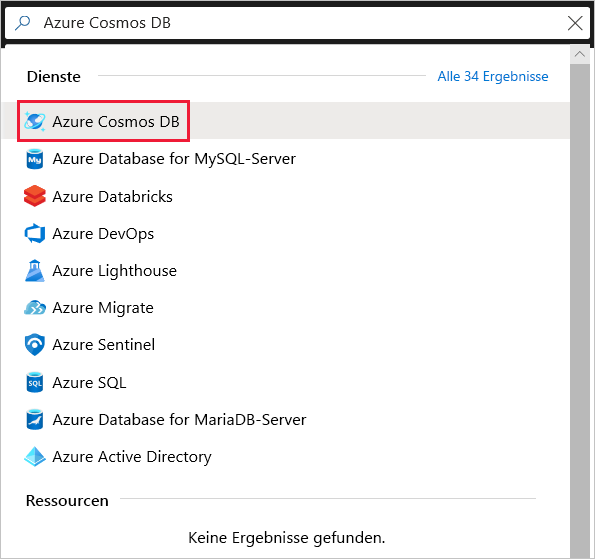
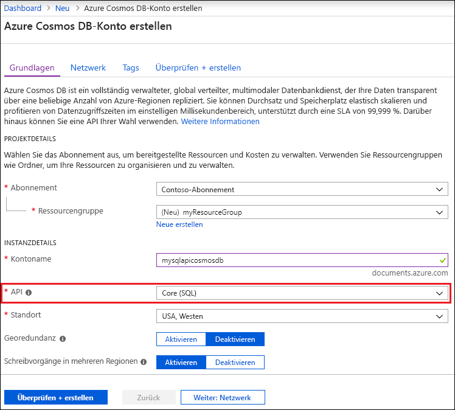

1. Melden Sie sich in einem neuen Browserfenster beim [Azure-Portal](https://portal.azure.com/) an.
2. Klicken Sie auf **Ressourcen erstellen** > **Datenbanken** > **Azure Cosmos DB**.
   
   

3. Geben Sie auf der Seite **Neues Konto** die Einstellungen für das neue Azure Cosmos DB-Konto ein. 
 
    Einstellung|Wert|BESCHREIBUNG
    ---|---|---
    ID|*Ein eindeutiger Name*|Geben Sie einen eindeutigen Namen ein, der Ihr Azure Cosmos DB-Konto identifiziert. Da *documents.azure.com* an die ID angefügt wird, die Sie für die URI-Erstellung angeben, muss die ID eindeutig sein.  Die ID darf nur Kleinbuchstaben, Zahlen und den Bindestrich (-) enthalten, und sie muss zwischen 3 und 50 Zeichen lang sein.
    API|SQL|Die API bestimmt den Typ des zu erstellenden Kontos. Azure Cosmos DB stellt fünf APIs bereit: SQL-API (Dokumentdatenbank), Gremlin-API (Graphdatenbank), MongoDB-API (Dokumentdatenbank), Tabellen-API und Cassandra-API. Jede API erfordert derzeit die Erstellung eines separaten Kontos.   In diesem Artikel wird eine Dokumentdatenbank erstellt und unter Verwendung der SQL-Syntax abgefragt. Wählen Sie daher **SQL** aus.   [Weitere Informationen zur SQL-API](../articles/cosmos-db/documentdb-introduction.md)|
    Abonnement|*Ihr Abonnement*|Wählen Sie das Azure-Abonnement aus, das Sie für dieses Azure Cosmos DB-Konto verwenden möchten. 
    Ressourcengruppe|Neu erstellen  *Derselbe eindeutige Name wie oben für die ID*|Wählen Sie **Neu erstellen** aus, und geben Sie dann einen neuen Ressourcengruppenname für Ihr Konto ein. Der Einfachheit halber können Sie denselben Namen wie bei Ihrer ID verwenden. 
    Standort|*Die Region, die Ihren Benutzern am nächsten liegt*|Wählen Sie einen geografischen Standort aus, an dem Ihr Azure Cosmos DB-Konto gehostet werden soll. Verwenden Sie einen Standort, der Ihren Benutzern am nächsten liegt, um ihnen einen schnellen Zugriff auf die Daten zu gewähren.
    Georedundanz aktivieren| Nicht ausfüllen | Dadurch wird eine replizierte Version Ihrer Datenbank in einer zweiten (zugeordneten) Region erstellt. Lassen Sie diese Einstellung leer.  

    Klicken Sie dann auf **Erstellen**.

    

4. Die Kontoerstellung dauert einige Minuten. Warten Sie, bis das Portal die Seite **Herzlichen Glückwunsch! Ihr Azure Cosmos DB-Konto wurde erstellt** anzeigt.

    

