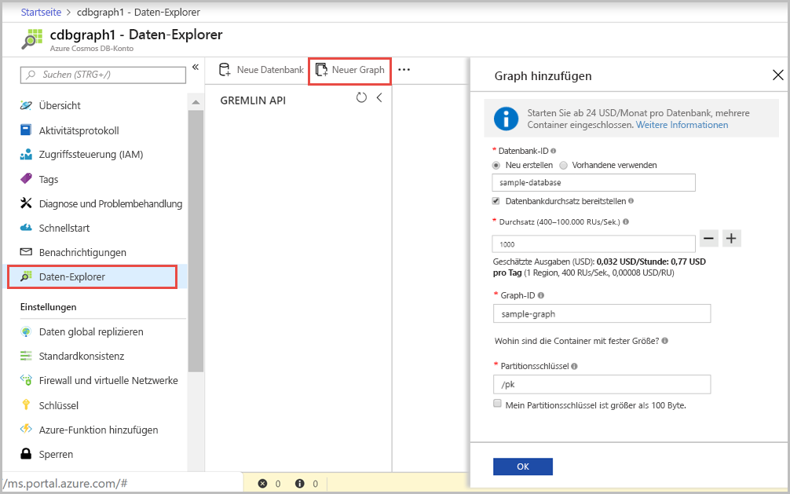

Sie können nun mithilfe des Daten-Explorer-Tools im Azure-Portal eine Diagrammdatenbank erstellen. 

1. Klicken Sie auf **Daten-Explorer** > **New Graph** (Neuer Graph).

    Der Bereich **Add Graph** (Graph hinzufügen) wird rechts angezeigt. Möglicherweise müssen Sie nach rechts scrollen, damit Sie ihn sehen.

    

2. Geben Sie auf der Seite **Graph hinzufügen** die Einstellungen für den neuen Graphen ein.

    Einstellung|Empfohlener Wert|BESCHREIBUNG
    ---|---|---
    Datenbank-ID|sample-database|Geben Sie *sample-database* als Namen für die neue Datenbank ein. Datenbanknamen müssen zwischen 1 und 255 Zeichen lang sein und dürfen weder `/ \ # ?` noch nachgestellte Leerzeichen enthalten.
    Throughput|400 RUs|Ändern Sie den Durchsatz in 400 Anforderungseinheiten pro Sekunde (RU/s). Sie können den Durchsatz später zentral hochskalieren, wenn Sie Wartezeiten reduzieren möchten.
    Graph-ID|sample-graph|Geben Sie *sample-graph* als Namen für die neue Sammlung ein. Für Diagrammnamen gelten dieselben Zeichenanforderungen wie für Datenbank-IDs.
    Partitionsschlüssel| /pk |Alle Cosmos DB-Konten benötigen zum horizontalen Skalieren einen Partitionsschlüssel. Informationen zum Auswählen eines geeigneten Partitionsschlüssels finden Sie unter [Verwenden eines partitionierten Graphen in Azure Cosmos DB](https://docs.microsoft.com/azure/cosmos-db/graph-partitioning).

3. Wenn das Formular ausgefüllt ist, klicken Sie auf **OK**.
