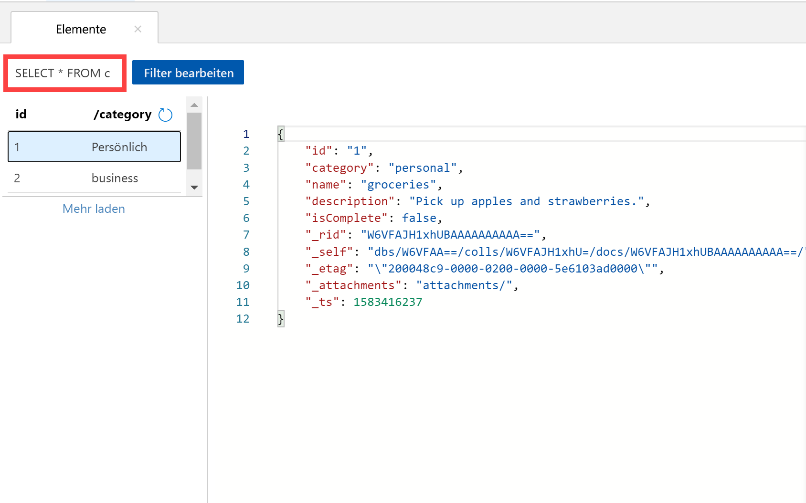
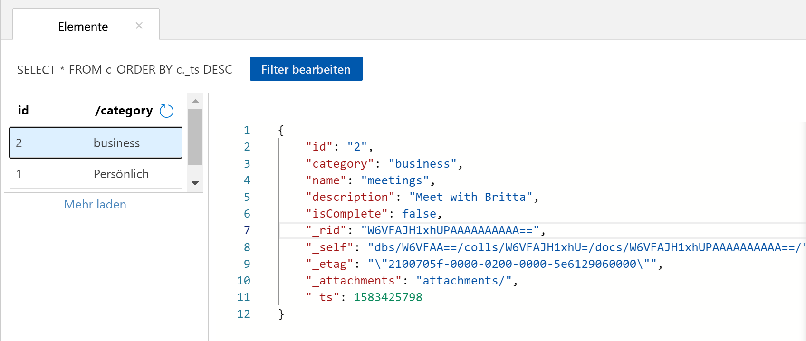

Sie können zum Abrufen und Filtern Ihrer Daten Abfragen im Daten-Explorer verwenden.

1. Sehen Sie sich im Daten-Explorer oben auf der Registerkarte **Elemente** die Standardabfrage `SELECT * FROM c` an. Diese Abfrage ruft alle Dokumente in der Sammlung ab und zeigt sie nach ID sortiert an. 
   
   
   
1. Wählen Sie zum Ändern der Abfrage **Filter bearbeiten** aus, ersetzen Sie die Standardabfrage durch`ORDER BY c._ts DESC`, und wählen Sie dann **Filter anwenden** aus.
   
   

   Mithilfe der geänderten Abfrage werden die Dokumente auf Basis ihrer Zeitstempel in absteigender Reihenfolge angezeigt, sodass Ihr zweites Dokument nun zuerst aufgeführt wird. 
   
   

Wenn Sie mit der SQL-Syntax vertraut sind, können Sie eine der unterstützten [SQL-Abfragen](../articles/cosmos-db/sql-api-sql-query.md) in das Feld für das Abfrageprädikat eingeben. Der Daten-Explorer kann auch zum Erstellen von gespeicherten Prozeduren, UDFs und Triggern für serverseitige Geschäftslogik verwendet werden. 

Der Daten-Explorer ermöglicht über das Azure-Portal einfachen Zugriff auf die gesamten integrierten programmgesteuerten Datenzugriffsfunktionen in den APIs. Sie verwenden das Portal außerdem zum Skalieren des Durchsatzes, zum Abrufen von Schlüsseln und Verbindungszeichenfolgen sowie zum Überprüfen von Metriken und SLAs für Ihr Azure Cosmos DB-Konto. 

