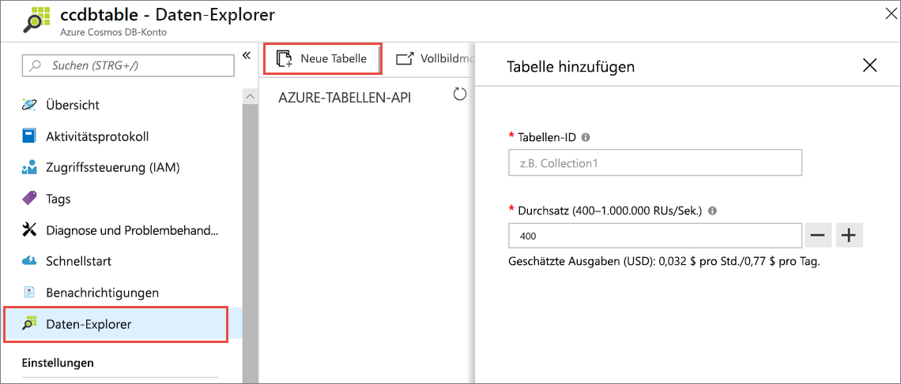
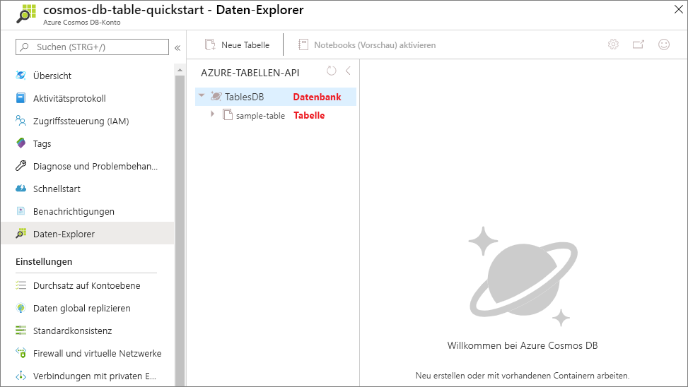

Sie können nun mithilfe des Daten-Explorer-Tools im Azure-Portal eine Datenbank und eine Tabelle erstellen. 

1. Klicken Sie auf **Daten-Explorer** > **Neue Tabelle**. 
    
    Der Bereich **Tabelle hinzufügen** wird ganz rechts angezeigt. Möglicherweise müssen Sie nach rechts scrollen, damit Sie ihn sehen.

    

2. Geben Sie auf der Seite **Tabelle hinzufügen** die Einstellungen für die neue Tabelle ein.

    Einstellung|Empfohlener Wert|BESCHREIBUNG
    ---|---|---
    Tabellen-ID|sample-table|Die ID Ihrer neuen Tabelle. Für Tabellennamen gelten dieselben Zeichenanforderungen wie für Datenbank-IDs. Datenbanknamen müssen zwischen 1 und 255 Zeichen lang sein und dürfen weder `/ \ # ?` noch nachgestellte Leerzeichen enthalten.
    Speicherkapazität| Fixed (10 GB)|Übernehmen Sie den Standardwert **Fest (10 GB)**. Dieser Wert gibt die Speicherkapazität der Datenbank an.
    Throughput|400 RUs|Ändern Sie den Durchsatz in 400 Anforderungseinheiten pro Sekunde (RU/s). Sie können den Durchsatz später zentral hochskalieren, wenn Sie Wartezeiten reduzieren möchten.

    Klicken Sie auf **OK**.

    Im Daten-Explorer werden die neue Datenbank und die neue Tabelle angezeigt.

    