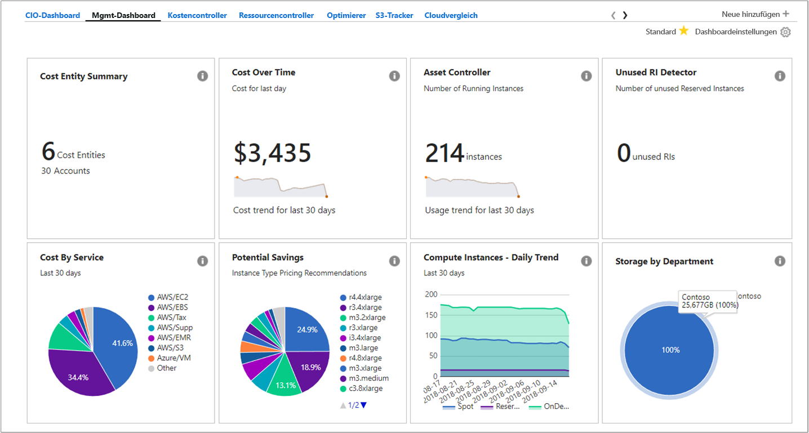
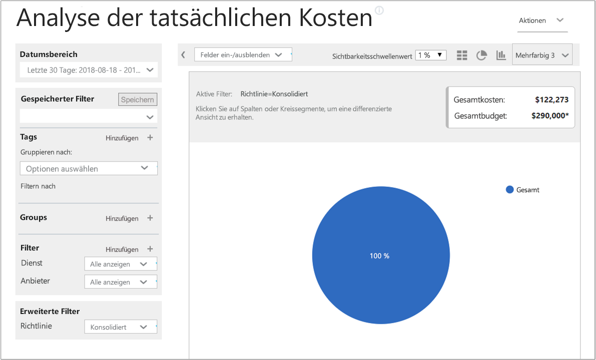
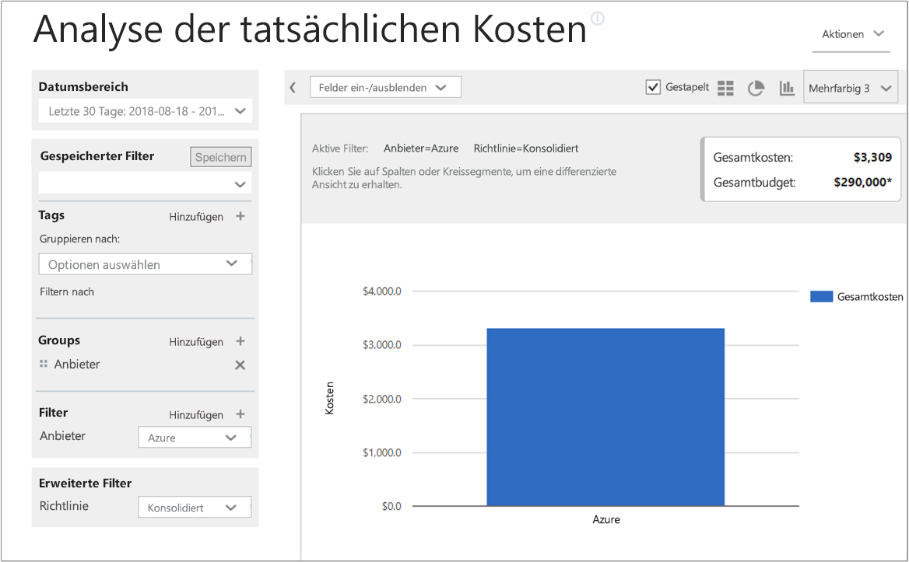
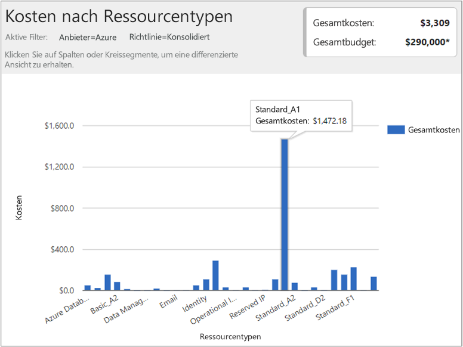
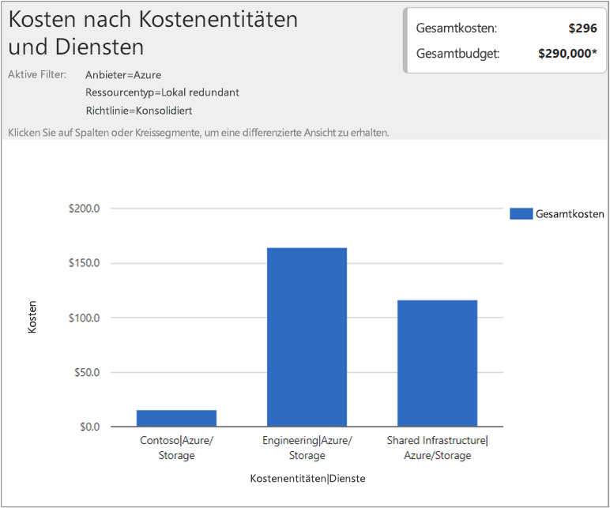

## Anzeigen von Kostendaten

Mit der Azure-Kostenverwaltung von Cloudyn haben Sie Zugriff auf Ihre gesamten Cloudressourcendaten. Im Dashboard werden sowohl Standardberichte als auch benutzerdefinierte Berichte in einer Registerkartenansicht angezeigt. Unten sind Beispiele für ein beliebtes Dashboard und einen Bericht angegeben, in denen die Kostendaten direkt angezeigt werden.

In diesem Beispiel sind im Dashboard für die Verwaltung die zusammengefassten Kosten für das Unternehmen Contoso über alle Cloudressourcen hinweg aufgeführt. Contoso nutzt Azure, AWS und Google. In Dashboards sehen Sie alle Informationen auf einen Blick und können zu Berichten navigieren.  

Wenn Sie sich nicht sicher sind, welchen Zweck ein Bericht in einem Dashboard erfüllt, können Sie mit der Maus auf das Symbol **i** zeigen, um eine Erklärung anzuzeigen. Klicken Sie in einem Dashboard auf einen beliebigen Bericht, um den gesamten Bericht anzuzeigen.

Sie können auch auf Berichte zugreifen, indem Sie oben im Portal das Menü für Berichte verwenden. Wir sehen uns nun die Contoso-Ausgaben für Azure-Ressourcen in den letzten 30 Tagen an. Klicken Sie auf **Kosten** > **Kostenanalyse** > **Actual Cost Analysis** (Analyse der Ist-Kosten). Löschen Sie alle Werte, falls für Tags, Gruppen oder Filter in Ihrem Bericht Werte festgelegt sind.

In diesem Beispiel betragen die Gesamtkosten 75.970 US-Dollar, und die Höhe des Budgets beträgt 130.000 US-Dollar.

Wir ändern jetzt das Berichtsformat und legen Gruppen und Filter fest, um die Ergebnisse für Azure-Kosten einzugrenzen. Legen Sie den **Datumsbereich** auf die letzten 30 Tage fest. Klicken Sie oben rechts auf das Spaltensymbol, um die Formatierung als Balkendiagramm durchzuführen, und wählen Sie unter „Gruppen“ die Option **Anbieter**. Legen Sie anschließend einen Filter für **Anbieter** auf **Azure** fest.

In diesem Beispiel betragen die Gesamtkosten für Azure-Ressourcen in den letzten 30 Tagen 3.839 US-Dollar.

Klicken Sie mit der rechten Maustaste auf den Balken „Anbieter (Azure)“, und navigieren Sie zu **Ressourcentypen**.

In der folgenden Abbildung sind die Kosten für Azure-Ressourcen dargestellt, die für Contoso angefallen sind. Die Gesamtsumme beträgt 3.839 US-Dollar. In diesem Beispiel ist ungefähr die Hälfte der Kosten für lokal redundanten Speicher und die andere Hälfte für verschiedene VM-Instanzen angefallen.

Klicken Sie mit der rechten Maustaste auf einen Ressourcentyp, und wählen Sie **Cost Entities** (Kostenentitäten), um die Kostenentitäten und die Dienste anzuzeigen, die die Ressource genutzt haben. Die Dienste „VM“ und „Workers“ haben in diesem Beispiel in DevOps 486,60 bzw. 435,71 US-Dollar verbraucht. Die Gesamtsumme beträgt 922 US-Dollar.

Ein Videotutorial zum Anzeigen von Cloudabrechnungsdaten finden Sie unter [Analyzing your cloud billing data with Azure Cost Management by Cloudyn](https://youtu.be/G0pvI3iLH-Y) (Analysieren Ihrer Cloudabrechnungsdaten mit Azure Cost Management von Cloudyn).
