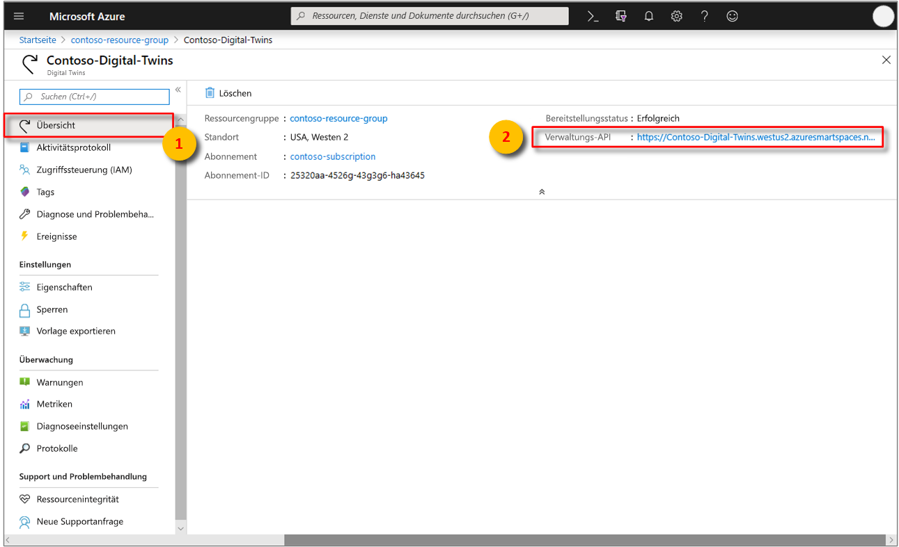

1. Melden Sie sich beim [Azure-Portal](http://portal.azure.com) an.

1. Wählen Sie im linken Bereich **Ressource erstellen** aus. Suchen Sie nach **Digital Twins**, und wählen Sie **Digital Twins** aus. Wählen Sie **Erstellen** aus, um den Bereitstellungsprozess zu starten.

   

1. Geben Sie im Bereich **Digital Twins** die folgenden Informationen ein:
   * **Ressourcenname:** Erstellen Sie einen eindeutigen Namen für Ihre Digital Twins-Instanz.
   * **Abonnement**: Wählen Sie das Abonnement aus, das Sie zum Erstellen dieser Digital Twins-Instanz verwenden möchten. 
   * **Ressourcengruppe**: Hier können Sie eine [Ressourcengruppe](https://docs.microsoft.com/azure/azure-resource-manager/resource-group-overview#resource-groups) für die Digital Twins-Instanz auswählen oder erstellen.
   * **Standort**: Wählen Sie den Standort aus, der Ihren Geräten am nächsten ist.

     

1. Überprüfen Sie Ihre Informationen zu Digital Twins, und wählen Sie **Erstellen** aus. Die Erstellung Ihrer Digital Twins-Instanz kann einige Minuten dauern. Sie können den Fortschritt im Bereich **Benachrichtigungen** überwachen.

1. Öffnen Sie den Bereich **Übersicht** Ihrer Digital Twins-Instanz. Beachten Sie den Link unter **Verwaltungs-API**.

   Die URL der **Verwaltungs-API** ist wie folgt formatiert: `https://yourDigitalTwinsName.yourLocation.azuresmartspaces.net/management/swagger`. Mit dieser URL gelangen Sie zur Dokumentation zur Azure Digital Twins-REST-API, die für Ihre Instanz gilt. Lesen Sie [Verwenden von Digital Twins Swagger](../articles/digital-twins/how-to-use-swagger.md), um zu erfahren, wie diese API-Dokumentation zu lesen und zu verwenden ist.

    Ändern Sie die URL der **Verwaltungs-API** in dieses Format: `https://yourDigitalTwinsName.yourLocation.azuresmartspaces.net/management/api/v1.0/`. Ihre Anwendung verwendet die geänderte URL als Basis-URL für den Zugriff auf Ihre Instanz. Kopieren Sie diese geänderten URL in eine temporäre Datei. Sie wird im nächsten Abschnitt benötigt.

    