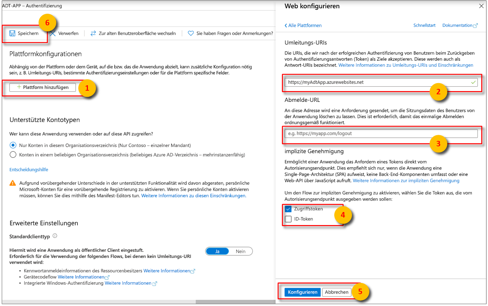

>[!NOTE]
>Dieser Abschnitt enthält Anweisungen für die [Azure AD-App-Registrierung](https://docs.microsoft.com/azure/active-directory/develop/quickstart-register-app).

1. Öffnen Sie im [Azure-Portal](https://portal.azure.com) im erweiterbaren Menü auf der linken Seite **Azure Active Directory** und anschließend den Bereich **App-Registrierungen**. 

    

1. Wählen Sie die Schaltfläche **+ Neue Registrierung** aus.

    

1. Geben Sie im Feld **Name** einen Anzeigenamen für diese App-Registrierung ein. 

    1. Geben Sie im Abschnitt **Umleitungs-URI (optional)** den Wert `https://microsoft.com` ins Textfeld ein.     

    1. Überprüfen Sie, welche Konten und Mandanten von Ihrer Azure Active Directory-App unterstützt werden.

    1. Wählen Sie **Registrieren**.

    

1. Auf dem Blatt **Authentifizierung** sind wichtige Konfigurationseinstellungen für die Authentifizierung angegeben. 

    1. Fügen Sie **Umleitungs-URIs** hinzu, und konfigurieren Sie **Zugriffstoken**, indem Sie **+ Plattform hinzufügen** auswählen.

    1. Wählen Sie **Ja** aus, um anzugeben, dass die App ein **öffentlicher Client** ist.

    1. Überprüfen Sie, welche Konten und Mandanten von Ihrer Azure Active Directory-App unterstützt werden.

    

1. Konfigurieren Sie nach der Auswahl der geeigneten Plattform die **Umleitungs-URIs** und **Zugriffstoken** im Seitenpanel rechts auf der Benutzeroberfläche.

    1. **Umleitungs-URIs** müssen mit der in der Authentifizierungsanforderung angegebenen Adresse übereinstimmen:

        * Wählen Sie für Anwendungen, die in einer lokalen Entwicklungsumgebung gehostet werden, **Öffentlicher Client (Mobilgerät und Desktop)** aus. Stellen Sie sicher, dass **Öffentlicher Client** auf **Ja** festgelegt ist.
        * Wählen Sie für in Azure App Service gehostete Einzelseiten-Apps **Web** aus.

    1. Legen Sie fest, ob eine **Abmelde-URL** geeignet ist.

    1. Aktivieren Sie den Ablauf für die implizite Genehmigung, indem Sie die Option **Zugriffstoken** oder **ID-Token** aktivieren.
                
    

    Klicken Sie auf **Konfigurieren** und dann auf **Speichern**.

1.  Öffnen Sie den Bereich **Übersicht** Ihrer registrierten App, und kopieren Sie die Werte der folgenden Entitäten in eine temporäre Datei. Mit diesen Werten konfigurieren Sie in den folgenden Abschnitten Ihre Beispielanwendung.

    - **Anwendungs-ID (Client)**
    - **Verzeichnis-ID (Mandant)**

    

1. Öffnen Sie den Bereich **API-Berechtigungen** für Ihre App-Registrierung. Wählen Sie die Schaltfläche **+ Berechtigung hinzufügen** aus. Wählen Sie im Bereich **API-Berechtigungen anfordern** die Registerkarte **Von meiner Organisation verwendete APIs** aus, und suchen Sie nach einer der folgenden Optionen:
    
    1. [https://login.microsoftonline.com/consumers/](`Azure Digital Twins`). Wählen Sie die API **Azure Digital Twins** aus.

        

    1. Oder suchen Sie nach `Azure Smart Spaces Service`. Wählen Sie die API **Azure Smart Spaces Service** aus.

        

    > [!IMPORTANT]
    > Welcher Name und welche ID für die Azure AD-API angezeigt werden, richtet sich nach Ihrem Mandanten:
    > * Bei Testmandanten- und Kundenkonten sollte nach `Azure Digital Twins` gesucht werden.
    > * Bei anderen Microsoft-Konten sollte nach `Azure Smart Spaces Service` gesucht werden.

1. Die ausgewählte API wird als **Azure Digital Twins** im gleichen Bereich (**API-Berechtigungen anfordern**) angezeigt. Wählen Sie die Dropdownoption **Lesen** aus, und aktivieren Sie anschließend das Kontrollkästchen **Read.Write**. Wählen Sie die Schaltfläche **Berechtigungen hinzufügen** aus.

    

1. Je nach Einstellungen Ihrer Organisation müssen Sie möglicherweise zusätzliche Schritte unternehmen, um dem Administrator Zugriff auf diese API zu gewähren. Weitere Informationen erhalten Sie von Ihrem Administrator. Nach Genehmigung des Administratorzugriffs werden Ihre Berechtigungen im Bereich **API-Berechtigungen** in der Spalte **Administratoreinwilligung erforderlich** angezeigt: 

    

    Vergewissern Sie sich, dass **Azure Digital Twins** angezeigt wird.
