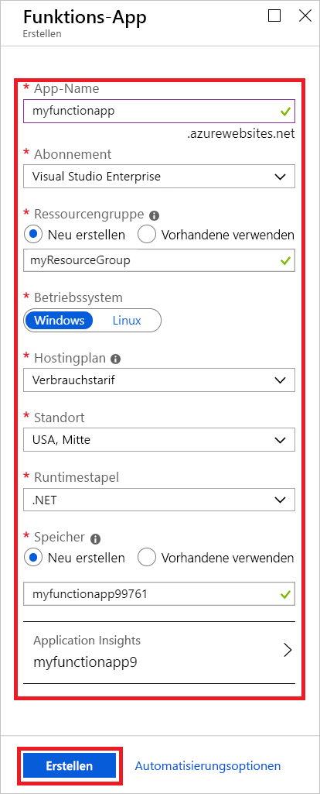

1. Wählen Sie in der linken oberen Ecke des Azure-Portals die Schaltfläche **Neu** und dann **Compute** > **Funktionen-App**.

    

2. Verwenden Sie die in der Tabelle unter der Abbildung angegebenen Einstellungen für die Funktions-App.

    

    | Einstellung      | Empfohlener Wert  | BESCHREIBUNG                                        |
    | ------------ |  ------- | -------------------------------------------------- |
    | **App-Name** | Global eindeutiger Name | Der Name, der Ihre neue Funktionen-App bezeichnet Gültige Zeichen sind `a-z`, `0-9` und `-`.  | 
    | **Abonnement** | Ihr Abonnement | Das Abonnement, unter dem diese neue Funktions-App erstellt wird. | 
    | **[Ressourcengruppe](../articles/azure-resource-manager/resource-group-overview.md)** |  myResourceGroup | Der Name der neuen Ressourcengruppe, in der die Funktionen-App erstellt wird |
    | **Betriebssystem** | Windows | Das serverlose Hosting ist derzeit nur bei der Ausführung unter Windows verfügbar. Weitere Informationen zum Hosting unter Linux finden Sie unter [Erstellen Ihrer ersten Funktion unter Linux in der Azure-Befehlszeilenschnittstelle](../articles/azure-functions/functions-create-first-azure-function-azure-cli-linux.md). |
    | **[Hostingplan](../articles/azure-functions/functions-scale.md)** | Verbrauchsplan | Der Hostingplan, der definiert, wie Ihre Ressourcen der Funktionen-App zugewiesen werden Im **Standard-Verbrauchstarif** werden Ressourcen je nach Bedarf der Funktionen dynamisch hinzugefügt. Beim [serverlosen Hosting](https://azure.microsoft.com/overview/serverless-computing/) bezahlen Sie nur die Zeit, in der Ihre Funktionen ausgeführt werden. Bei der Ausführung in einem App Service-Plan müssen Sie die [Skalierung Ihrer Funktions-App](../articles/azure-functions/functions-scale.md) verwalten.  |
    | **Location** | Europa, Westen | Wählen Sie eine [Region](https://azure.microsoft.com/regions/) in Ihrer Nähe oder in der Nähe von anderen Diensten aus, auf die Ihre Funktionen zugreifen. |
    | **Laufzeitstapel** | Bevorzugte Sprache | Wählen Sie eine Runtime aus, die Ihre bevorzugte Programmiersprache für Funktionen unterstützt. Wählen Sie **.NET** für C#- und F#-Funktionen aus. |
    | **[Storage](../articles/storage/common/storage-quickstart-create-account.md)** |  Global eindeutiger Name |  Erstellen Sie ein Speicherkonto, das von Ihrer Funktions-App verwendet wird. Speicherkontonamen müssen zwischen 3 und 24 Zeichen lang sein und dürfen nur Zahlen und Kleinbuchstaben enthalten. Sie können auch ein vorhandenes Konto verwenden, das die [Anforderungen an das Speicherkonto](../articles/azure-functions/functions-scale.md#storage-account-requirements) erfüllen muss. |
    | **[Application Insights](../articles/azure-functions/functions-monitoring.md)** | Standard | Application Insights ist standardmäßig aktiviert. Wählen Sie einen Speicherort in der Nähe Ihrer Funktions-App.  |

3. Klicken Sie auf **Erstellen**, um die Funktionen-App bereitzustellen.

4. Wählen Sie oben rechts im Portal das Benachrichtigungssymbol aus, und achten Sie auf die Meldung **Bereitstellung erfolgreich**.

    

5. Wählen Sie **Zu Ressource wechseln**, um Ihre neue Funktionen-App anzuzeigen.

> [!TIP]
> Sollten Sie Ihre Funktions-Apps im Portal nicht finden, können Sie [Funktionen-Apps Ihren Favoriten im Azure-Portal hinzufügen](../articles/azure-functions/functions-how-to-use-azure-function-app-settings.md#favorite).
