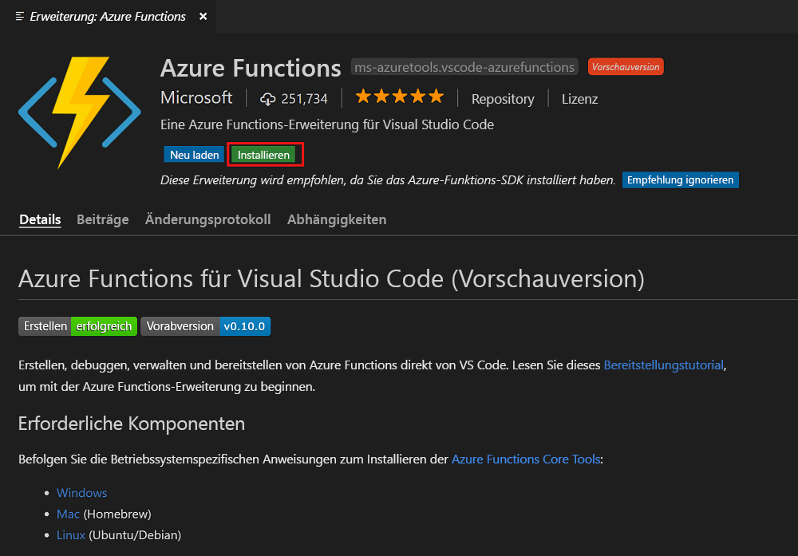

## Installieren der Azure Functions-Erweiterung

Sie können die Azure Functions-Erweiterung verwenden, um Funktionen zu erstellen und zu testen und in Azure bereitzustellen.

1. Öffnen Sie in Visual Studio Code die Option **Erweiterungen**, und suchen Sie nach **azure functions**, oder öffnen Sie [diesen Link](vscode:extension/ms-azuretools.vscode-azurefunctions) in Visual Studio Code.

1. Wählen Sie **Installieren** aus, um die Erweiterung für Visual Studio Code zu installieren:

    

1. Starten Sie Visual Studio Code neu, und wählen Sie auf der Aktivitätsleiste das Azure-Symbol aus. Auf der Seitenleiste sollte ein Azure Functions-Bereich angezeigt werden.

    