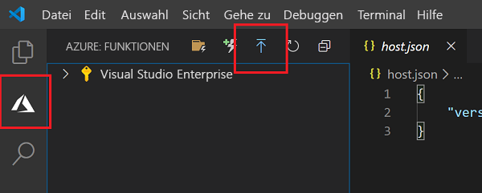

## Veröffentlichen des Projekts in Azure

In diesem Abschnitt erstellen Sie eine Funktions-App sowie zugehörige Ressourcen in Ihrem Azure-Abonnement und stellen anschließend Ihren Code bereit. 

1. Wählen Sie auf der Aktivitätsleiste das Azure-Symbol und anschließend im Bereich **Azure: Funktionen** die Schaltfläche **Deploy to function app...** (In Funktions-App bereitstellen...) aus.

    

1. Geben Sie nach entsprechender Aufforderung Folgendes ein:

    ::: zone pivot="programming-language-csharp,programming-language-powershell"

    | Aufforderung | Wert | Beschreibung |
    | ------ | ----- | ----- |
    | Auswählen des Abonnements | Ihr Abonnement | Wird angezeigt, wenn Sie über mehrere Abonnements verfügen. |
    | „Select Function App in Azure“ (Wählen Sie die Funktions-App in Azure aus.) | „+ Create New Function App“ (+ Neue Funktions-App erstellen) | Beim Veröffentlichen in einer vorhandenen Funktions-App wird der Inhalt dieser App in Azure überschrieben. |
    | „Enter a globally unique name for the function app“ (Geben Sie einen global eindeutigen Namen für die Funktions-App ein.) | Eindeutiger Name | Gültige Zeichen für den Namen einer Funktions-App sind `a-z`, `0-9` und `-`. |
    | Auswählen eines Speicherorts für neue Ressourcen | Region | Wählen Sie eine [Region](https://azure.microsoft.com/regions/) in Ihrer Nähe aus. | 

    ::: zone-end

    ::: zone pivot="programming-language-javascript,programming-language-typescript,programming-language-python"

    | Aufforderung | Wert | Beschreibung |
    | ------ | ----- | ----- |
    | Auswählen des Abonnements | Ihr Abonnement | Wird angezeigt, wenn Sie über mehrere Abonnements verfügen. |
    | „Select Function App in Azure“ (Wählen Sie die Funktions-App in Azure aus.) | „+ Create New Function App“ (+ Neue Funktions-App erstellen) | Beim Veröffentlichen in einer vorhandenen Funktions-App wird der Inhalt dieser App in Azure überschrieben. |
    | „Enter a globally unique name for the function app“ (Geben Sie einen global eindeutigen Namen für die Funktions-App ein.) | Eindeutiger Name | Gültige Zeichen für den Namen einer Funktions-App sind `a-z`, `0-9` und `-`. |
    | „Select a runtime“ (Wählen Sie eine Runtime aus.) | Ihre Version | Wählen Sie die lokal ausgeführte Sprachversion aus. |
    | Auswählen eines Speicherorts für neue Ressourcen | Region | Wählen Sie eine [Region](https://azure.microsoft.com/regions/) in Ihrer Nähe aus. | 

    ::: zone-end

    
1.  Nach Abschluss des Vorgangs werden in Ihrem Abonnement die folgenden Azure-Ressourcen erstellt:

    + **[Ressourcengruppe](../articles/azure-resource-manager/management/overview.md)** : Enthält alle erstellten Azure-Ressourcen. Der Name basiert auf dem Namen Ihrer Funktions-App.
    + **[Speicherkonto](../articles//storage/common/storage-introduction.md#types-of-storage-accounts)** : Ein Standardspeicherkonto wird mit einem eindeutigen Namen erstellt, der auf dem Namen Ihrer Funktions-App basiert.
    + **[Hostingplan](../articles/azure-functions/functions-scale.md)** : Ein Verbrauchsplan wird in der Region „USA, Westen“ erstellt, um Ihre serverlose Funktions-App zu hosten.
    + **Funktions-App**: Ihr Projekt wird in dieser neuen Funktions-App bereitgestellt, wo es auch ausgeführt wird.
    + **[Application Insights]()** : Eine mit Ihrer Funktions-App verbundene Instanz wird auf der Grundlage Ihres Funktionsnamens erstellt.

    Nach der Erstellung der Funktions-App wird eine Benachrichtigung angezeigt, und das Bereitstellungspaket wird angewendet. 
    
1. Wählen Sie in dieser Benachrichtigungen **Ausgabe anzeigen** aus, um die Erstellungs- und Bereitstellungsergebnisse (auch für die von Ihnen erstellten Azure-Ressourcen) anzuzeigen.

    

1. Erweitern Sie im Bereich **Azure: Funktionen** auf der Seitenleiste die neue Funktions-App unter Ihrem Abonnement. Erweitern Sie **Funktionen**, klicken Sie mit der rechten Maustaste (Windows) bzw. klicken Sie bei gedrückter CTRL-TASTE (macOS) auf **HttpExample**, und wählen Sie **Copy function URL** (Funktions-URL kopieren) aus.

    
