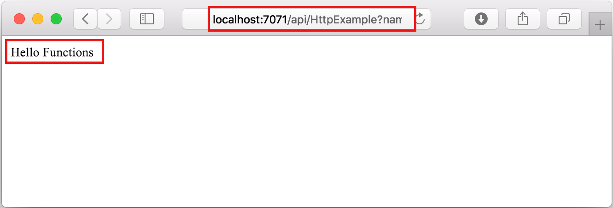

## Lokales Ausführen der Funktion

Dank der Integration zwischen Visual Studio Code und [Azure Functions Core Tools](../articles/azure-functions/functions-run-local.md) können Sie dieses Projekt vor der Veröffentlichung in Azure zunächst auf Ihrem lokalen Entwicklungscomputer ausführen.

1. Drücken Sie zum Aufrufen Ihrer Funktion F5, um das Funktions-App-Projekt zu starten. Die Ausgabe der Core Tools wird im Bereich **Terminal** angezeigt.

1. Falls Sie Azure Functions Core Tools noch nicht installiert haben, wählen Sie bei entsprechender Aufforderung die Option **Installieren** aus. Wenn die Core Tools installiert sind, wird Ihre App im Bereich **Terminal** gestartet.

1. Kopieren Sie im Bereich **Terminal** den URL-Endpunkt Ihrer über HTTP ausgelösten Funktion. 

    

1. Fügen Sie die URL der HTTP-Anforderung in die Adresszeile des Browsers ein. Hängen Sie anschließend die Abfragezeichenfolge `?name=<yourname>` an diese URL an, und führen Sie die GET-Anforderung aus. 

1. Die zurückgegebene Antwort sieht in einem Browser in etwa wie folgt aus:

    

1. Drücken Sie UMSCHALT+F5, um die Core Tools zu beenden und die Verbindung mit dem Debugger zu trennen.
