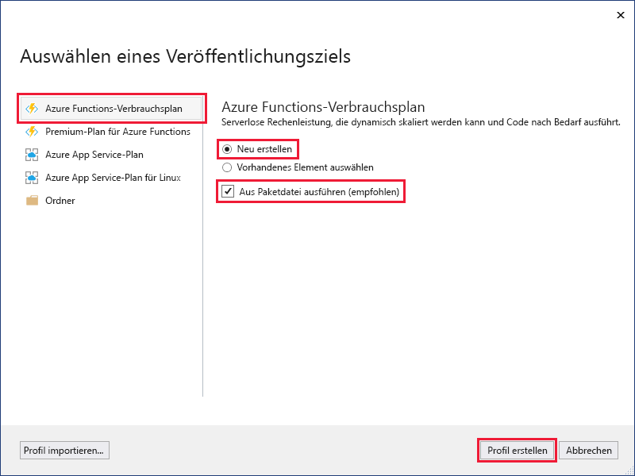

1. Klicken Sie im **Projektmappen-Explorer** mit der rechten Maustaste auf das Projekt, und wählen Sie **Veröffentlichen** aus.

2. Wählen Sie **Azure-Funktionen-App**, **Neu erstellen** und dann **Veröffentlichen**.

     

    Wenn Sie auf **Run from a package file (recommended)** (Aus Paketdatei ausführen (empfohlen)) klicken, wird Ihre Funktions-App unter Verwendung der [ZIP-Bereitstellung](../articles/azure-functions/functions-deployment-technologies.md#zip-deploy) mit aktiviertem [Run-From-Package](../articles/azure-functions/run-functions-from-deployment-package.md)-Modus bereitgestellt. Dies Vorgehensweise wird zum Ausführen Ihrer Funktionen empfohlen und erzielt eine bessere Leistung.

    >[!CAUTION]
    >Bei der Auswahl von **Vorhandene auswählen** werden alle Dateien in der vorhandenen Funktions-App in Azure durch Dateien aus dem lokalen Projekt überschrieben. Verwenden Sie diese Option nur, wenn Sie erneut Updates für eine vorhandene Funktions-App veröffentlichen.

3. Wenn Sie Visual Studio noch nicht mit Ihrem Azure-Konto verbunden haben, wählen Sie **Konto hinzufügen** aus.

4. Verwenden Sie im Dialogfeld **App Service erstellen** die **Hosting**-Einstellungen in der Tabelle unter der Abbildung:

    

    | Einstellung      | Empfohlener Wert  | BESCHREIBUNG                                |
    | ------------ |  ------- | -------------------------------------------------- |
    | **App-Name** | Global eindeutiger Name | Name, der Ihre neue Funktions-App eindeutig identifiziert. |
    | **Abonnement** | Auswählen Ihres Abonnements | Das zu verwendende Azure-Abonnement. |
    | **[Ressourcengruppe](../articles/azure-resource-manager/resource-group-overview.md)** | myResourceGroup |  Name der Ressourcengruppe, in der die Funktions-App erstellt wird. Wählen Sie **Neu** aus, um eine neue Ressourcengruppe zu erstellen.|
    | **[App Service-Plan](../articles/azure-functions/functions-scale.md)** | Verbrauchsplan | Achten Sie darauf, unter **Größe** den **Verbrauch** auszuwählen, nachdem Sie auf **Neu** geklickt haben, um einen serverlosen Tarif zu erstellen. Wählen Sie einen **Standort** in einer [Region](https://azure.microsoft.com/regions/) in Ihrer Nähe oder in der Nähe anderer Dienste aus, auf die Ihre Funktionen zugreifen. Bei der Ausführung in einem anderen Plan als **Verbrauch** müssen Sie die [Skalierung Ihrer Funktions-App](../articles/azure-functions/functions-scale.md) verwalten.  |
    | **[Speicherkonto](../articles/storage/common/storage-quickstart-create-account.md)** | Universelles Speicherkonto | Für die Functions-Runtime wird ein Azure Storage-Konto benötigt. Klicken Sie auf **Neu**, um ein universelles Speicherkonto zu erstellen. Sie können auch ein vorhandenes Konto verwenden, das die [Anforderungen an das Speicherkonto](../articles/azure-functions/functions-scale.md#storage-account-requirements) erfüllt.  |

5. Klicken Sie auf **Erstellen**, um eine Funktions-App und zugehörige Ressourcen in Azure mit diesen Einstellungen zu erstellen und Ihren Funktionsprojektcode bereitzustellen. 

6. Notieren Sie sich nach Abschluss der Bereitstellung den Wert der **Website-URL**, da es sich dabei um die Adresse Ihrer Funktions-App in Azure handelt.

    
