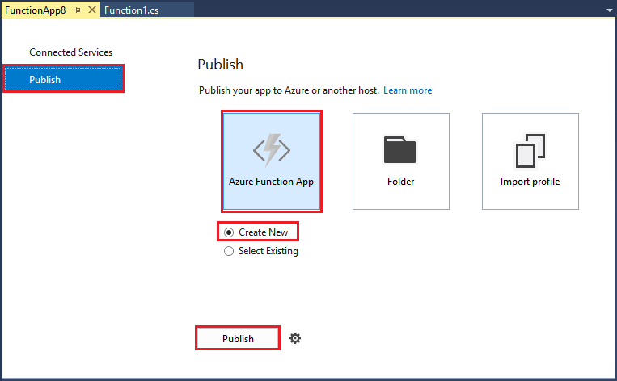
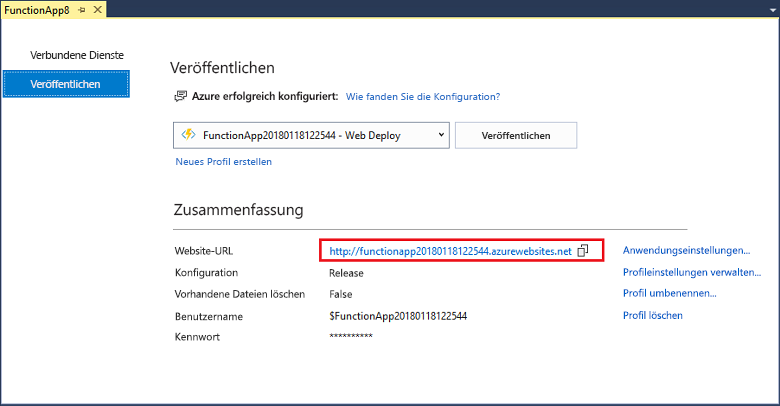

Klicken Sie im **Projektmappen-Explorer** mit der rechten Maustaste auf das Projekt, und wählen Sie **Veröffentlichen** aus. Wählen Sie **Neu erstellen**, und klicken Sie dann auf **Veröffentlichen**. 

Wenn Sie Visual Studio noch nicht mit Ihrem Azure-Konto verbunden haben, klicken Sie auf **Konto hinzufügen...**.  

Verwenden Sie im Dialogfeld **App Service erstellen** die in der Tabelle angegebenen Hosting-Einstellungen. 

| Einstellung      | Empfohlener Wert  | Beschreibung                                |
| ------------ |  ------- | -------------------------------------------------- |
| **App-Name** | Global eindeutiger Name | Name, der Ihre neue Funktions-App eindeutig identifiziert. |
| **Abonnement** | Auswählen Ihres Abonnements | Das zu verwendende Azure-Abonnement. |
| **[Ressourcengruppe](../articles/azure-resource-manager/resource-group-overview.md)** | myResourceGroup |  Name der Ressourcengruppe, in der die Funktions-App erstellt wird. |
| **[App Service-Plan](../articles/azure-functions/functions-scale.md)** | Verbrauchsplan | Achten Sie darauf, den **Verbrauch** unter **Größe** zu wählen, wenn Sie einen neuen Plan erstellen.  |
| **[Speicherkonto](../articles/storage/storage-create-storage-account.md#create-a-storage-account)** | Global eindeutiger Name | Verwenden ein vorhandenes Speicherkonto aus, oder erstellen Sie ein neues.   |

Klicken Sie auf **Erstellen**, um in Azure eine Funktions-App mit diesen Einstellungen zu erstellen. Notieren Sie sich nach Abschluss der Bereitstellung den Wert der **Website-URL**, da es sich dabei um die Adresse Ihrer Funktions-App in Azure handelt. 

