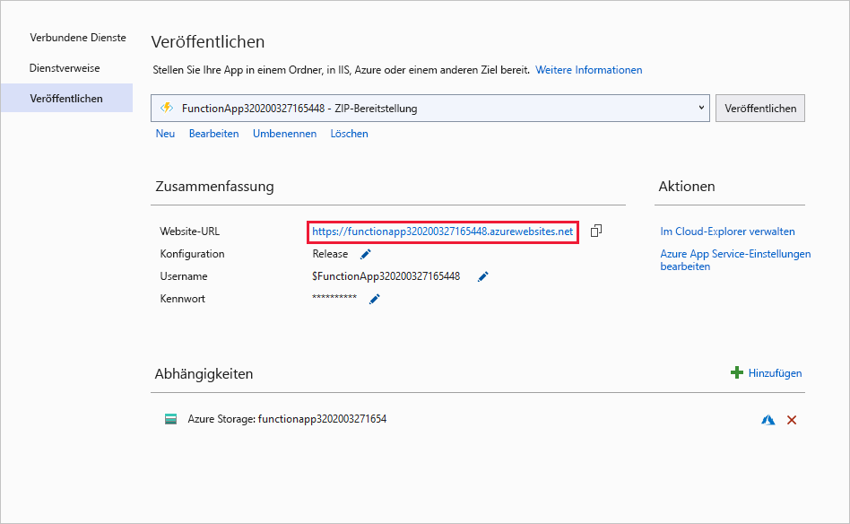

1. Klicken Sie im **Projektmappen-Explorer** mit der rechten Maustaste auf das Projekt, und wählen Sie **Veröffentlichen** aus.

2. Verwenden Sie im Dialogfeld **Veröffentlichungsziel auswählen** die Veröffentlichungsoptionen, wie in der Tabelle unterhalb der Abbildung angegeben: 

    

    | Option      | Beschreibung                                |
    | ------------ |  -------------------------------------------------- |
    | **Azure Functions-Nutzungsplan** |   Wenn Sie Ihr Projekt in einer Funktions-App veröffentlichen, die in einem [Verbrauchsplan](../articles/azure-functions/functions-scale.md#consumption-plan) ausgeführt wird, bezahlen Sie nur für die Ausführungen Ihrer Funktions-App. Für andere Hostingpläne fallen höhere Kosten an. Weitere Informationen finden Sie unter [Skalierung und Hosting von Azure Functions](../articles/azure-functions/functions-scale.md). | 
    | **Neu erstellen** | Eine neue Funktions-App wird mit zugehörigen Ressourcen in Azure erstellt. Bei der Auswahl von **Vorhandene auswählen** werden alle Dateien in der vorhandenen Funktions-App in Azure durch Dateien aus dem lokalen Projekt überschrieben. Verwenden Sie diese Option nur, wenn Sie erneut Updates für eine vorhandene Funktions-App veröffentlichen. |
    | **Aus Paketdatei ausführen** | Ihre Funktions-App wird unter Verwendung der [ZIP-Bereitstellung](../articles/azure-functions/functions-deployment-technologies.md#zip-deploy) mit aktiviertem Modus [Run-From-Package](../articles/azure-functions/run-functions-from-deployment-package.md) bereitgestellt. Dies Vorgehensweise wird zum Ausführen Ihrer Funktionen empfohlen und erzielt eine bessere Leistung. Wenn Sie diese Option nicht verwenden, stellen Sie vor der Veröffentlichung in Azure sicher, dass das Funktions-App-Projekt nicht lokal ausgeführt wird. |

3. Wählen Sie **Veröffentlichen**. Falls Sie sich noch nicht über Visual Studio bei Ihrem Azure-Konto angemeldet haben, wählen Sie **Anmelden** aus. Sie können auch ein kostenloses Azure-Konto erstellen.

4. Verwenden Sie im Dialogfeld **Azure App Service: Neu erstellen** die **Hostingeinstellungen** wie in der Tabelle unter der Abbildung angegeben:

    

    | Einstellung      | Vorgeschlagener Wert  | Beschreibung                                |
    | ------------ |  ------- | -------------------------------------------------- |
    | **Name** | Global eindeutiger Name | Name, der Ihre neue Funktions-App eindeutig identifiziert. Gültige Zeichen sind `a-z`, `0-9` und `-`. |
    | **Abonnement** | Auswählen Ihres Abonnements | Das zu verwendende Azure-Abonnement. |
    | **[Ressourcengruppe](../articles/azure-resource-manager/management/overview.md)** | myResourceGroup |  Name der Ressourcengruppe, in der die Funktions-App erstellt wird. Wählen Sie **Neu** aus, um eine neue Ressourcengruppe zu erstellen.|
    | **[Hostingplan](../articles/azure-functions/functions-scale.md)** | Verbrauchsplan | Achten Sie darauf, unter **Größe** den **Verbrauch** auszuwählen, nachdem Sie **Neu** ausgewählt haben, um einen serverlosen Tarif zu erstellen. Wählen Sie einen **Standort** in einer [Region](https://azure.microsoft.com/regions/) in Ihrer Nähe oder in der Nähe anderer Dienste aus, auf die Ihre Funktionen zugreifen. Bei der Ausführung in einem anderen Plan als **Verbrauch** müssen Sie die [Skalierung Ihrer Funktions-App](../articles/azure-functions/functions-scale.md) verwalten.  |
    | **[Azure Storage](../articles/storage/common/storage-account-create.md)** | Universelles Speicherkonto | Für die Functions-Runtime wird ein Azure Storage-Konto benötigt. Wählen Sie **Neu** aus, um ein universelles Speicherkonto zu erstellen. Sie können auch ein vorhandenes Konto verwenden, das die [Anforderungen an das Speicherkonto](../articles/azure-functions/functions-scale.md#storage-account-requirements) erfüllt.  |

5. Wählen Sie **Erstellen** aus, um eine Funktions-App und zugehörige Ressourcen in Azure mit diesen Einstellungen zu erstellen und Ihren Funktionsprojektcode bereitzustellen. 

6. Notieren Sie sich nach Abschluss der Bereitstellung den Wert der **Website-URL**, da es sich dabei um die Adresse Ihrer Funktions-App in Azure handelt.

    
