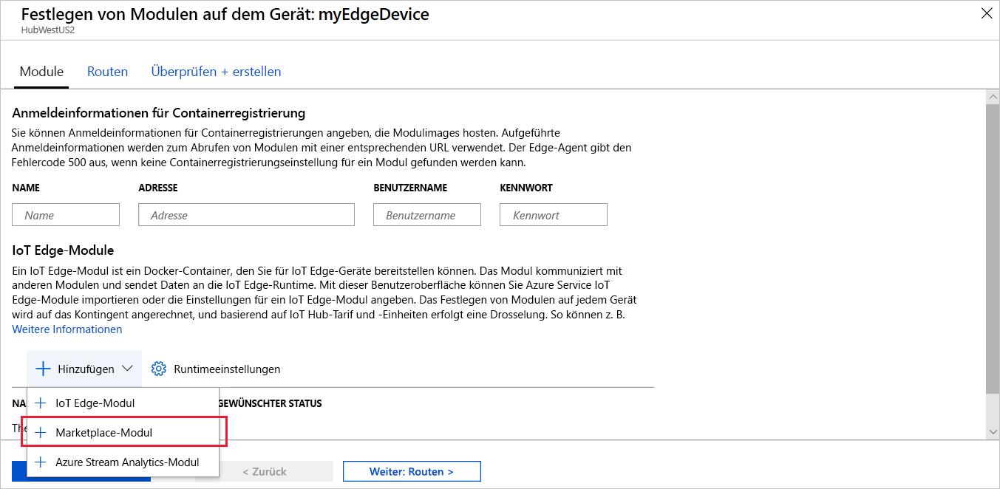
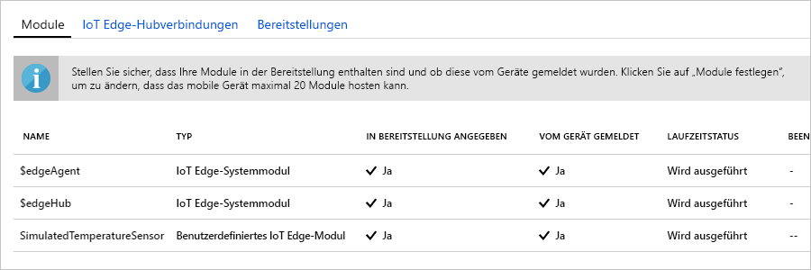

Eine der wichtigen Funktionen von Azure IoT Edge ist die Möglichkeit, Code aus der Cloud auf IoT Edge-Geräten bereitzustellen. Bei **IoT Edge-Modulen** handelt es sich um ausführbare Pakete, die als Container implementiert werden. In diesem Abschnitt stellen Sie ein fertig erstelltes Modul aus dem [Bereich mit den IoT Edge-Modulen im Azure Marketplace](https://azuremarketplace.microsoft.com/marketplace/apps/category/internet-of-things?page=1&subcategories=iot-edge-modules) bereit. 

Mit dem in diesem Abschnitt bereitgestellten Modul wird ein Sensor simuliert, und es werden Daten generiert. Der Code dieses Moduls ist nützlich, wenn Sie die ersten Schritte mit IoT Edge ausführen, weil Sie die simulierten Daten für die Entwicklung und das Testen nutzen können. Wenn Sie genau sehen möchten, was mit diesem Modul durchgeführt wird, können Sie den [Quellcode für den simulierten Temperatursensor anzeigen](https://github.com/Azure/iotedge/blob/027a509549a248647ed41ca7fe1dc508771c8123/edge-modules/SimulatedTemperatureSensor/src/Program.cs). 

Führen Sie die folgenden Schritte aus, um über den Azure Marketplace Ihr erstes Modul bereitzustellen:

1. Geben Sie im [Azure-Portal](https://portal.azure.com) **Simulated Temperature Sensor** (Simulierter Temperatursensor) in das Suchfeld ein, und öffnen Sie das Marketplace-Ergebnis.

   

2. Wählen Sie ein IoT Edge-Gerät aus, das dieses Modul empfangen soll. Geben Sie auf der Seite **Zielgeräte für IoT Edge-Modul** die folgenden Informationen ein:

   1. **Abonnement**: Wählen Sie das Abonnement aus, das den von Ihnen verwendeten IoT-Hub enthält.

   2. **IoT Hub**: Wählen Sie den Namen des verwendeten IoT-Hubs aus.

   3. **Name des IoT Edge-Geräts**: Wenn Sie den Namen des vorgeschlagenen Geräts bereits zuvor in diesem Schnellstart verwendet haben, geben Sie **meinEdgeGerät** ein. Wählen Sie andernfalls **Gerät suchen**, um aus einer Liste mit IoT Edge-Geräten auf Ihrem IoT-Hub ein Gerät auszuwählen. 
   
   4. Klicken Sie auf **Erstellen**.

3. Nachdem Sie nun ein IoT Edge-Modul im Azure Marketplace und ein IoT Edge-Gerät für das Modul ausgewählt haben, gelangen Sie zu einem aus drei Schritten bestehenden Assistenten, der Sie bei der genauen Definition der Modulbereitstellung unterstützt. Beachten Sie im Schritt **Module hinzufügen** des Assistenten, dass das Modul **SimulatedTemperatureSensor** (Simulierter Temperatursensor) automatisch aufgefüllt wird. In den Tutorials verwenden Sie diese Seite, um Ihrer Bereitstellung weitere Module hinzuzufügen. Im Rahmen dieses Schnellstarts stellen Sie einfach dieses eine Modul bereit. Wählen Sie **Weiter** aus, um mit dem nächsten Schritt des Assistenten fortzufahren.

4. Im Schritt **Specify Routes** (Routen festlegen) des Assistenten definierten Sie, wie Nachrichten zwischen Modulen und dem IoT Hub übergeben werden. Im Rahmen des Schnellstarts sollen alle Nachrichten von allen Modulen an den IoT Hub (`$upstream`) gelangen. Wenn er nicht automatisch aufgefüllt wurde, fügen Sie den folgenden Code hinzu:

   ```json
    {
    "routes": {
        "route": "FROM /messages/* INTO $upstream"
        }
    }
   ```
   Klicken Sie anschließend auf **Weiter**.

5. Im Schritt **Bereitstellung überprüfen** des Assistenten können Sie eine Vorschau der JSON-Datei anzeigen, in der alle Module definiert sind, die auf Ihrem IoT Edge-Gerät bereitgestellt werden. Beachten Sie, dass hier das Modul **SimulatedTemperatureSensor** ebenso wie zwei zusätzliche Systemmodule mit den Namen **edgeAgent** und **edgeHub** enthalten sind. Wählen Sie **Übermitteln** aus, wenn Sie die Überprüfung abgeschlossen haben.

   Wenn Sie eine neue Bereitstellung an ein IoT Edge-Gerät übermitteln, wird nichts per Push auf Ihr Gerät übertragen. Stattdessen fragt das Gerät den IoT Hub regelmäßig nach neuen Anweisungen ab. Wenn das Gerät ein aktualisiertes Bereitstellungsmanifest findet, werden die Informationen zur neuen Bereitstellung verwendet, um die Modulimages per Pullvorgang aus der Cloud abzurufen. Anschließend wird die lokale Ausführung der Module gestartet. Dieser Vorgang kann einige Minuten in Anspruch nehmen. 

6. Nachdem Sie die Bereitstellungsdetails des Moduls übermittelt haben, werden Sie vom Assistenten zur Seite **IoT Edge** Ihres IoT Hubs zurück geführt. Wählen Sie Ihr Gerät in der Liste der IoT Edge-Geräte aus, um seine Details anzuzeigen. 

7. Scrollen Sie auf der Detailseite des Geräts nach unten zum Abschnitt **Module**. Dort sollten drei Module aufgelistet sein: $edgeAgent, $edgeHub und SimulatedTemperatureSensor. Wenn mindestens ein Modul als in der Bereitstellung angegeben aufgeführt ist, vom Gerät aber nicht gemeldet wird, ist Ihr IoT Edge-Gerät noch mit dem Startvorgang beschäftigt. Warten Sie einige Minuten, und wählen Sie oben auf der Seite **Aktualisieren** aus. 

   
