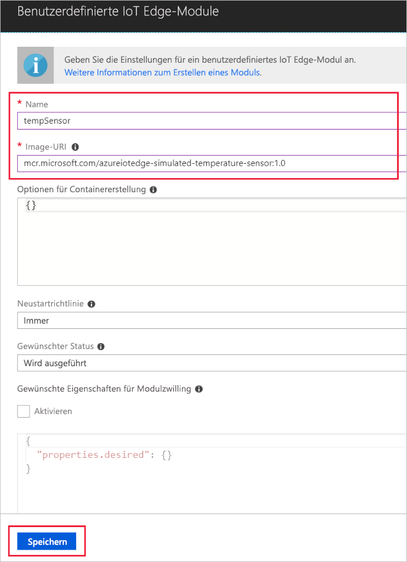

Eine der wichtigen Funktionen von Azure IoT Edge ist die Möglichkeit, Module aus der Cloud auf IoT Edge-Geräten bereitzustellen. Ein IoT-Edge-Modul ist ein ausführbares Paket, das als Container implementiert wird. In diesem Abschnitt stellen Sie ein Modul bereit, das Telemetrie für das simulierte Gerät generiert.

1. Navigieren Sie im Azure-Portal zu Ihrem IoT Hub.
1. Navigieren Sie zu **IoT Edge** (unter **Automatische Geräteverwaltung**), und wählen Sie Ihr IoT Edge-Gerät aus.
1. Wählen Sie **Module festlegen** aus.
1. Klicken Sie im Abschnitt **Bereitstellungsmodule** des Schritts **Module hinzufügen** auf **Hinzufügen**, und wählen Sie anschließend **IoT Edge-Modul** aus.
1. Geben Sie im Feld **Name** die Zeichenfolge `tempSensor` ein.
1. Geben Sie im Feld **Image-URI** die Zeichenfolge `mcr.microsoft.com/azureiotedge-simulated-temperature-sensor:1.0` ein.
1. Behalten Sie die restlichen Einstellungen unverändert bei, und wählen Sie **Speichern** aus.

   

1. Wenn Sie zum Schritt **Module hinzufügen** zurückgekehrt sind, wählen Sie **Weiter** aus.
1. Im Schritt zum **Angeben von Routen** sollten Sie über eine Standardroute verfügen, über die alle Nachrichten von allen Modulen an IoT Hub gesendet werden. Wenn nicht, können Sie den folgenden Code eingeben und dann **Weiter** wählen.

   ```json
   {
       "routes": {
           "route": "FROM /messages/* INTO $upstream"
       }
   }
   ```

1. Klicken Sie im Schritt für die **Bereitstellungsüberprüfung** auf **Übermitteln**.
1. Kehren Sie zur Seite mit Gerätedetails zurück, und wählen Sie **Aktualisieren** aus. Zusätzlich zum edgeAgent-Modul, das beim ersten Starten des Diensts erstellt wurde, sollte ein weiteres Runtimemodul mit dem Namen **edgeHub** angezeigt werden, und das Modul **tempSensor** sollte aufgeführt sein.

   
