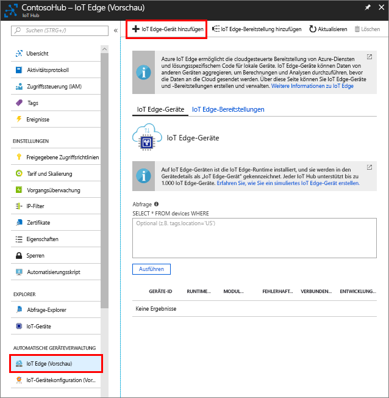

Erstellen Sie eine Geräteidentität für das simulierte Gerät, sodass es mit dem IoT Hub kommunizieren kann. Da IoT Edge-Geräte sich von typischen IoT-Geräten unterscheiden und auf unterschiedliche Weise verwaltet werden können, deklarieren Sie dieses Gerät von Anfang an als IoT Edge-Gerät. 

1. Navigieren Sie im Azure-Portal zu Ihrem IoT Hub.
1. Klicken Sie auf **IoT Edge** und dann auf **Add IoT Edge Device** (IoT Edge-Gerät hinzufügen).

   

1. Weisen Sie dem simulierten Gerät eine eindeutige Geräte-ID zu.
1. Wählen Sie **Speichern** aus, um das Gerät hinzuzufügen.
1. Wählen Sie das neue Gerät in der Liste der Geräte aus.
1. Kopieren Sie den Wert für **Verbindungszeichenfolge – Primärschlüssel**, und speichern Sie ihn. Sie verwenden diesen Wert, um im nächsten Abschnitt die IoT Edge-Runtime zu konfigurieren. 

