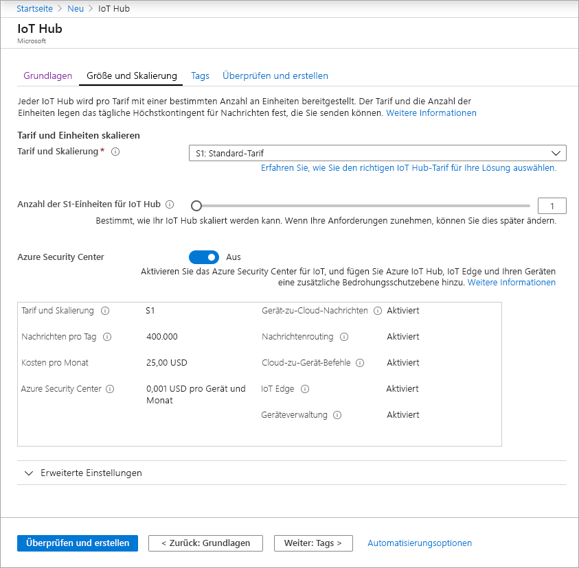

In diesem Abschnitt wird beschrieben, wie Sie über das [Azure-Portal](https://portal.azure.com) einen IoT-Hub erstellen:

1. Melden Sie sich beim [Azure-Portal](https://portal.azure.com) an.

1. Wählen Sie auf der Azure-Startseite die Schaltfläche **+ Ressource erstellen** aus, und geben Sie dann ins Feld **Marketplace durchsuchen** den Begriff *IoT Hub* ein.

1. Wählen Sie in den Suchergebnissen **IoT Hub** und dann **Erstellen** aus.

1. Füllen Sie auf der Registerkarte **Grundlegende Einstellungen** die Felder wie folgt aus:

   - **Abonnement**: Wählen Sie das Abonnement aus, das Sie für Ihren Hub verwenden möchten.

   - **Ressourcengruppe**: Wählen Sie eine vorhandene Ressourcengruppe aus, oder erstellen Sie eine neue. Wählen Sie zum Erstellen einer neuen Ressourcengruppe die Option **Neu erstellen** aus, und geben Sie den Namen ein, den Sie verwenden möchten. Wenn Sie eine vorhandene Ressourcengruppe verwenden möchten, wählen Sie die entsprechende Ressourcengruppe aus. Weitere Informationen finden Sie unter [Verwalten von Azure Resource Manager-Ressourcengruppen](../articles/azure-resource-manager/manage-resource-groups-portal.md).

   - **Region**: Wählen Sie die Region aus, in der sich Ihr Hub befinden soll. Wählen Sie den Standort aus, der Ihnen am nächsten ist.

   - **IoT Hub-Name**: Geben Sie einen Namen für den Hub ein. Dieser Name muss global eindeutig sein. Wenn der eingegebene Name verfügbar ist, wird ein grünes Häkchen angezeigt.

   [!INCLUDE [iot-hub-pii-note-naming-hub](iot-hub-pii-note-naming-hub.md)]

   

1. Klicken Sie auf **Weiter: Größe und Skalierung**, um die Erstellung Ihres Hubs fortzusetzen.

   

    Auf diesem Bildschirm können Sie die folgenden Werte festlegen:

    - **Tarif und Skalierung**: Ihre ausgewählte Ebene. Ihnen stehen abhängig davon, wie viele Features Sie verwenden und wie viele Nachrichten Sie über Ihre Lösung pro Tag senden möchten, mehrere Tarife zur Auswahl. Der kostenlose Tarif ist für Test und Bewertung vorgesehen. Damit kann für 500 Geräte eine Verbindung mit dem Hub hergestellt werden, und bis zu 8.000 Nachrichten pro Tag sind möglich. Jedes Azure-Abonnement kann einen IoT-Hub im kostenlosen Tarif erstellen.

    - **IoT Hub-Einheiten**: Die Anzahl der pro Einheit und Tag zulässigen Nachrichten hängt von Ihrem Hubtarif ab. Beispiel: Wenn der Hub 700.000 eingehende Nachrichten unterstützen soll, wählen Sie zwei Einheiten des Tarifs S1.
    Einzelheiten zu den anderen Tarifoptionen finden Sie unter [Skalieren einer IoT Hub-Lösung](../articles/iot-hub/iot-hub-scaling.md).

    - **Erweiterte Einstellungen** > **Gerät-zu-Cloud-Partitionen**: Diese Eigenschaft setzt die Gerät-zu-Cloud-Nachrichten in Relation zur Anzahl von gleichzeitigen Lesern der Nachrichten. Die meisten Hubs benötigen nur vier Partitionen.

1. Übernehmen Sie in diesem Artikel die Standardoptionen, und wählen Sie dann **Überprüfen + erstellen** aus, um Ihre Auswahl zu überprüfen. Die Anzeige entspricht in etwa dem folgenden Bildschirm.

   

1. Wählen Sie **Erstellen** aus, um Ihren neuen Hub zu erstellen. Das Erstellen des Hubs dauert einige Minuten.
