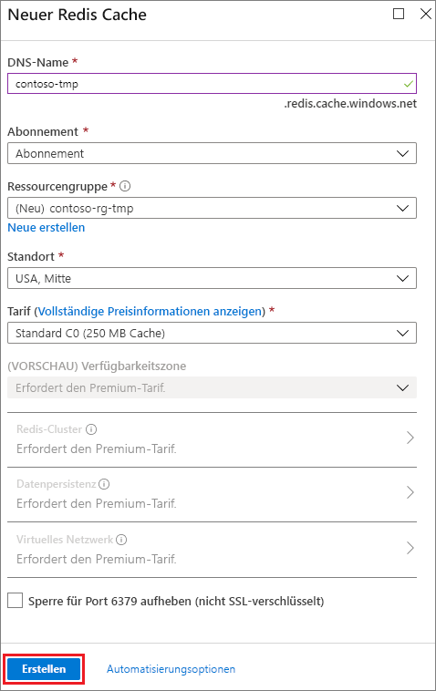

Melden Sie sich zum Erstellen eines Caches zunächst beim [Azure-Portal](https://portal.azure.com) an, und klicken Sie dann auf **Ressource erstellen** > **Datenbanken** > **Redis Cache**.

> [!NOTE]
> Falls Sie noch nicht über ein Azure-Konto verfügen, können Sie in nur wenigen Minuten ein [kostenloses Azure-Konto erstellen](https://azure.microsoft.com/pricing/free-trial/?WT.mc_id=redis_cache_hero) .
> 
> 

> [!NOTE]
> Sie können Caches nicht nur über das Azure-Portal, sondern auch mithilfe von Resource Manager-Vorlagen, PowerShell oder der Azure-Befehlszeilenschnittstelle erstellen.
> 
> * Weitere Informationen zum Erstellen eines Caches mithilfe von Resource Manager-Vorlagen finden Sie unter [Erstellen einer Redis Cache-Instanz mithilfe einer Vorlage](../articles/redis-cache/cache-redis-cache-arm-provision.md).
> * Weitere Informationen zum Erstellen eines Caches mit Azure PowerShell finden Sie unter [Verwalten von Azure-Redis-Cache mit Azure PowerShell](../articles/redis-cache/cache-howto-manage-redis-cache-powershell.md).
> * Weitere Informationen zum Erstellen eines Caches mit der Azure-Befehlszeilenschnittstelle finden Sie unter [Erstellen und Verwalten von Azure Redis Cache mithilfe der Azure-Befehlszeilenschnittstelle (Azure CLI)](../articles/redis-cache/cache-manage-cli.md).
> 
> 

Geben unter **Neuer Redis Cache** die gewünschte Konfiguration für den Cache an.

 

* Geben Sie unter **DNS-Name** einen eindeutigen Cachenamen für den Cacheendpunkt ein. Der Cachename muss zwischen 1 und 63 Zeichen lang sein und darf nur Zahlen, Buchstaben und das Zeichen `-` enthalten. Der Cachename darf weder mit dem Zeichen `-` beginnen oder enden, noch mehrere aufeinanderfolgende Zeichen vom Typ `-` enthalten.
* Wählen Sie unter **Abonnement**das Azure-Abonnement für den Cache aus. Falls das Konto nur über ein einzelnes Abonnement verfügt, wird automatisch dieses Abonnement ausgewählt, und die Dropdownliste **Abonnement** wird nicht angezeigt.
* Unter **Ressourcengruppe**können Sie eine Ressourcengruppe für Ihren Cache auswählen oder erstellen. Weitere Informationen finden Sie unter [Verwenden von Ressourcengruppen zum Verwalten von Azure-Ressourcen](../articles/azure-resource-manager/resource-group-overview.md). 
* Unter **Standort** können Sie einen geografischen Standort für Ihren Cache auswählen. Um optimale Leistungen zu erzielen, empfiehlt Microsoft, den Cache in der Region zu erstellen, in der sich auch die Cacheclientanwendung befindet.
* Verwenden Sie **Tarif**, um die gewünschte Größe und die Merkmale für den Cache auszuwählen.
* **Redis-Cluster** ermöglichen Ihnen das Erstellen von Caches größer als 53 GB und das Sharding von Daten auf mehrere Redis-Knoten. Weitere Informationen finden Sie unter [Konfigurieren von Clustern für Azure Redis Cache vom Typ "Premium"](../articles/redis-cache/cache-how-to-premium-clustering.md).
* **Redis-Persistenz** ermöglicht das dauerhafte Speichern Ihres Caches in einem Azure Storage-Konto. Informationen zum Konfigurieren von Persistenz finden Sie unter [Konfigurieren von Persistenz für Azure Redis Cache vom Typ "Premium"](../articles/redis-cache/cache-how-to-premium-persistence.md).
* **Virtual Network** bietet erhöhte Sicherheit und Isolierung durch Einschränken des Zugriffs auf Ihren Cache auf ausschließlich Clients im angegebenen Azure Virtual Network. Sie können alle Features von VNet, z. B. Subnetze, Richtlinien für die Zugriffssteuerung und andere Features, verwenden, um den Zugriff auf Redis weiter einzuschränken. Weitere Informationen finden Sie unter [Konfigurieren der Unterstützung virtueller Netzwerke für Azure Redis Cache vom Typ "Premium"](../articles/redis-cache/cache-how-to-premium-vnet.md).
* Der Zugriff ohne SSL ist für neue Caches standardmäßig deaktiviert. Aktivieren Sie **Sperre für Port 6379 aufheben (nicht SSL-verschlüsselt)**, um den Nicht-SSL-Port zu aktivieren.

Klicken Sie nach der Konfiguration der Optionen für den neuen Cache auf **Erstellen**. Die Erstellung des Caches kann einige Minuten dauern. Sie können den Fortschritt im Startmenü überwachen, um den Status zu überprüfen. Nach der Erstellung des Caches hat der neue Cache den Status **Wird ausgeführt** und kann mit [Standardeinstellungen](../articles/redis-cache/cache-configure.md#default-redis-server-configuration)verwendet werden.

