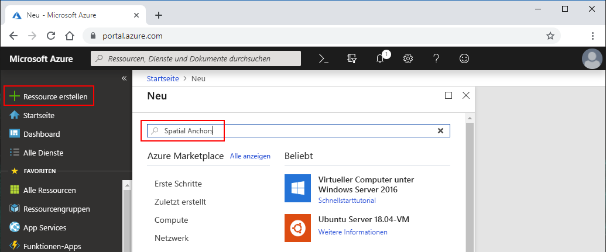
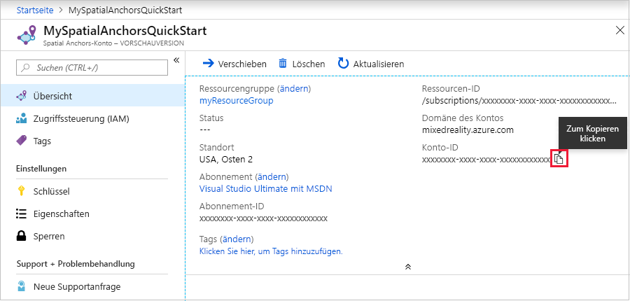

## Erstellen einer Spatial Anchors-Ressource

1. Navigieren Sie zum <a href="https://portal.azure.com" target="_blank">Azure-Portal</a>.

2. Wählen Sie im linken Menü des Azure-Portals die Option **Ressource erstellen** aus.

3. Suchen Sie über die Suchleiste nach „Spatial Anchors“.

   

4. Wählen Sie **Spatial Anchors (Vorschauversion)** aus, um ein Dialogfeld zu öffnen, und wählen Sie dann **Erstellen** aus.

5. Gehen Sie im Formular **Spatial Anchors-Konto** wie folgt vor:

   1. Geben Sie einen eindeutigen Ressourcennamen an.
   2. Wählen Sie das Abonnement aus, an das die Ressource angefügt werden soll.
   3. Erstellen Sie eine Ressourcengruppe. Wählen Sie hierzu **Neu erstellen** aus, nennen Sie die Ressourcengruppe **myResourceGroup**, und wählen Sie **OK** aus.
      [!INCLUDE [resource group intro text](resource-group.md)]
   4. Wählen Sie einen Standort (Region) aus, an dem die Ressource platziert werden soll.
   5. Wählen Sie **Neu** aus, um mit der Ressourcenerstellung zu beginnen.

   

6. Wenn die Ressource erfolgreich erstellt wurde, können Sie die Ressourceneigenschaften anzeigen. Notieren Sie sich die **Konto-ID** der Ressource für später.

   

7. Wählen Sie unter **Einstellungen** die Option **Schlüssel** aus, und notieren Sie sich den **Primärschlüssel**. Dieser Wert ist der Kontoschlüssel (`Account Key`) und wird später benötigt.

   
