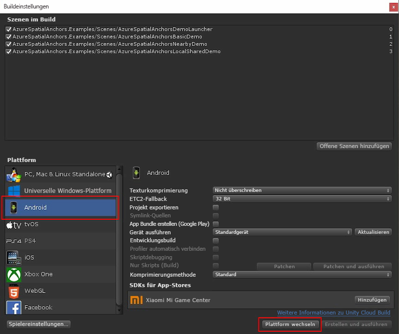

Öffnen Sie Unity, und öffnen Sie das Projekt im Ordner `Unity`.

Wählen Sie **Datei** -> **Buildeinstellungen** aus, um **Buildeinstellungen** zu öffnen.

Wählen Sie im Abschnitt **Plattform** die Option **Android** aus. Ändern Sie dann das **Buildsystem** in **Gradle**, und aktivieren Sie die Option **Projekt exportieren**.

Wählen Sie **Plattform wechseln** aus, um die Plattform in **Android** zu ändern. Unity fordert Sie bei Bedarf zur Installation fehlender unterstützender Android-Komponenten auf.

Schließen Sie das Fenster **Buildeinstellungen**.

### Herunterladen und Importieren des ARCore SDK für Unity

Laden Sie die Datei `unitypackage` aus den [ARCore SDK-Releases für Unity](https://github.com/google-ar/arcore-unity-sdk/releases/tag/v1.5.0) herunter. Wählen Sie im Unity-Projekt **Ressourcen** -> **Paket importieren** -> **Benutzerdefiniertes Paket...** und anschließend die Datei `unitypackage` aus, die Sie zuvor heruntergeladen haben. Vergewissern Sie sich im Dialogfeld zum **Importieren des Unity-Pakets**, dass alle Dateien ausgewählt sind, und wählen Sie dann **Importieren** aus.
