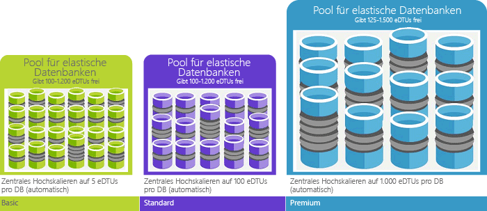

Die Datenbankdurchsatzeinheit (Database Throughput Unit, DTU) ist die Maßeinheit in SQL-Datenbank, die die relative Leistung einer Datenbank bei der Verarbeitung von Transaktionen in Anbetracht der Einschränkungen der Hardware zur Steuerung der Datenbank darstellt. DTU ähnelt dem Konzept der PS-Leistung von Autos. Es beschreibt die relative Leistung einer Datenbank im Vergleich zu einer anderen. Genau wie bei den Pferdestärken von Autos hat eine Datenbank mit einem höheren DTU-Wert auch mehr Leistung. Die Funktion zur PS-Berechnung hängt von vielen verschiedenen Faktoren ab: Gewicht, Hubraum, Turbo, Abgassystem. Ebenso ist die DTU eine Funktion für Menge und Art der von der Datenbank nutzbaren Speicher, Berechnungen und Datenträger. Details zur Ermittlung der DTU finden Sie unter [Übersicht über die Azure SQL-Datenbankvergleichstests](https://msdn.microsoft.com/library/azure/dn741327.aspx)).

Beispiel: Eine Basic-Datenbank verfügt über 5 DTUs. Das bedeutet, dass sie relativ erheblich weniger Kapazität für Transaktionsdurchsatz hat als eine P11 Premium-Datenbank, die 1750 DTUs aufweist.

Die DTU für Einzeldatenbanken kann direkt in die eDTU für elastische Datenbanken übertragen werden. Beispielsweise bietet eine Datenbank in einem Pool mit elastischen Basic-Datenbanken bis zu 5 eDTUs. Das ist eine ähnliche Leistung wie bei einer Basic-Einzeldatenbank. Der Unterschied besteht darin, dass elastische Datenbanken keine eDTUs aus dem Pool verwenden, bis dies erforderlich ist.

Ein einfaches Beispiel veranschaulicht dies. Nehmen Sie einen elastischen Basic-Datenbankpool mit 1.000 DTUs, in dem Sie 800 Datenbanken ablegen. Solange nur 200 der 800 Datenbanken zu einem beliebigen Zeitpunkt genutzt werden (5 DTU X 200 = 1.000), wird die maximale Kapazität des Pools nicht erreicht wird und die Leistung der Datenbank nicht beeinträchtigt. In diesem Beispiel wird aus Gründen der Übersichtlichkeit vereinfacht. In Wirklichkeit sind die Dinge ein wenig komplizierter. Das Portal erledigt die komplizierten Aufgaben für Sie und gibt eine Empfehlung basierend auf der bisherigen Verwendung der Datenbank ab. Weitere Informationen zu den Empfehlungen oder zum Selbermachen finden Sie unter [Überlegungen zum Preis und zur Leistung für einen elastischen Datenbankpool](../articles/sql-database/sql-database-elastic-pool-guidance.md).

<!---HONumber=Oct15_HO3-->