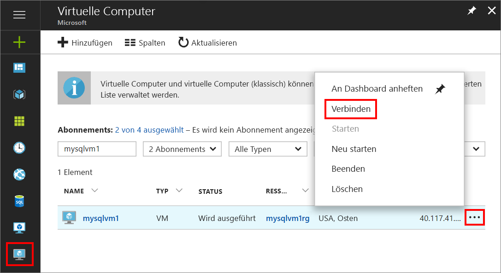
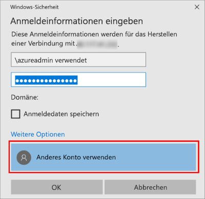

Führen Sie die folgenden Schritte aus, um mithilfe von Remotedesktop eine Verbindung mit dem virtuellen SQL Server-Computer herzustellen:

1. Wenn der virtuelle Azure-Computer erstellt wurde und ausgeführt wird, klicken Sie im Azure-Portal auf das Symbol für virtuelle Computer, um Ihre virtuellen Computer anzuzeigen.

1. Klicken Sie auf die Auslassungspunkte **...** für den neuen virtuellen Computer.

1. Klicken Sie auf **Verbinden**.

   

1. Öffnen Sie die **RDP**-Datei, die vom Browser für den virtuellen Computer heruntergeladen wird.

1. Sie werden von der Remotedesktopverbindung informiert, dass der Herausgeber dieser Remoteverbindung nicht identifiziert werden kann. Klicken Sie auf **Verbinden** , um den Vorgang fortzusetzen.

1. Klicken Sie im Dialogfeld **Windows-Sicherheit** auf **Anderes Konto verwenden**. Möglicherweise müssen Sie auf **More choices** (Mehr Optionen) klicken, um diese Option anzuzeigen. Geben Sie den Benutzernamen und das Kennwort an, den bzw. das Sie bei der Erstellung des virtuellen Computers konfiguriert haben. Sie müssen einen umgekehrten Schrägstrich vor dem Benutzernamen einfügen.

   

Nachdem Sie eine Verbindung mit dem virtuellen SQL Server-Computer hergestellt haben, können Sie SQL Server Management Studio starten und mit Ihren Anmeldeinformationen für den lokalen Administrator eine Verbindung mit der Windows-Authentifizierung herstellen. Wenn Sie die SQL Server-Authentifizierung aktiviert haben, können Sie die Verbindung auch per SQL-Authentifizierung herstellen, indem Sie den während der Bereitstellung konfigurierten SQL-Benutzernamen und das Kennwort verwenden.

Durch den Zugriff auf den Computer können Sie die Computer- und SQL Server-Einstellungen je nach Ihren Anforderungen direkt ändern. Beispielsweise können Sie die Firewalleinstellungen konfigurieren oder die SQL Server-Konfigurationseinstellungen ändern.